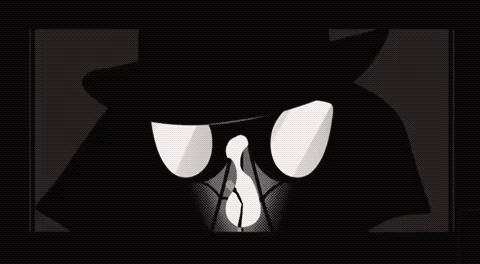

---

title: "About gh0stkn1ght"

date: 2025-10-10

draft: false

layout: "single"

---

Hey! I'm **M Sai Preetham Reddy**, a cybersecurity enthusiast and DFIR  Analyst documenting my journey through the digital forensics landscape.

## What I Do

I specialize in **Digital Forensics & Incident Response (DFIR)** with a focus on:

## What I Do

I specialize in **Digital Forensics & Incident Response (DFIR)** across multiple domains:

- 🔬 **Forensic Analysis** - Analyzing memory dumps, disk images, and file systems
- 🦠 **Malware Analysis** - Reverse engineering and behavioral analysis
- 🌐 **Network Forensics** - Traffic analysis and threat detection
- 🎯 **CTFs** - Playing and authoring forensics challenges
- 🕵️ **Threat Hunting** - Investigating adversarial TTPs

## Current Role

**DFIR Analyst** at **Team bi0s** - India's #1 ranked CTF team

I conduct forensic investigations, design CTF challenges, and contribute to security research focusing on defensive techniques and incident response methodologies.

## What You'll Find Here

This blog is my digital notebook where I share:

- 📝 **CTF Writeups** - Detailed walkthroughs of forensics and malware challenges

- 🔬 **Research Notes** - DFIR techniques and tools

- 💡 **Analysis** - Breaking down real-world incidents and attack patterns

- 🛠️ **Tools** - Custom scripts and automation for forensic investigations

## Connect

- **GitHub:** [gh0stkn1gh7](https://github.com/gh0stkn1gh7)

- **Twitter:** [@mspr75](https://twitter.com/mspr75)

- **Email:** [mspreethamreddy75@gmail.com](mailto:mspreethamreddy75@gmail.com)

---

*Every artifact tells a story. Every memory dump hides secrets. The question is: are you looking hard enough?* 🕷️
